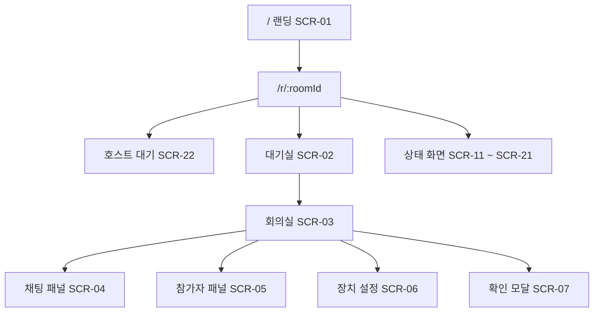
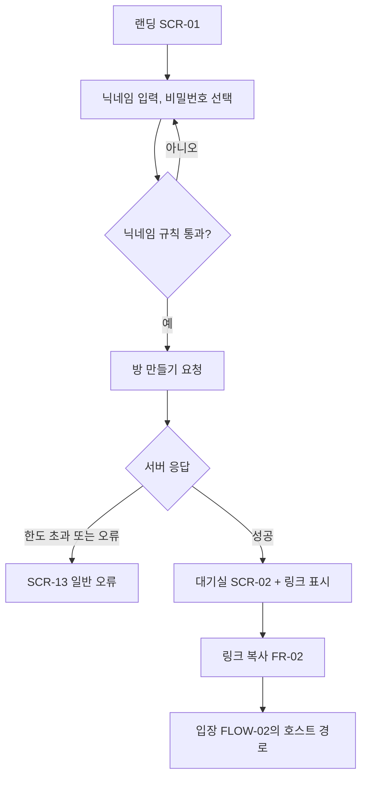
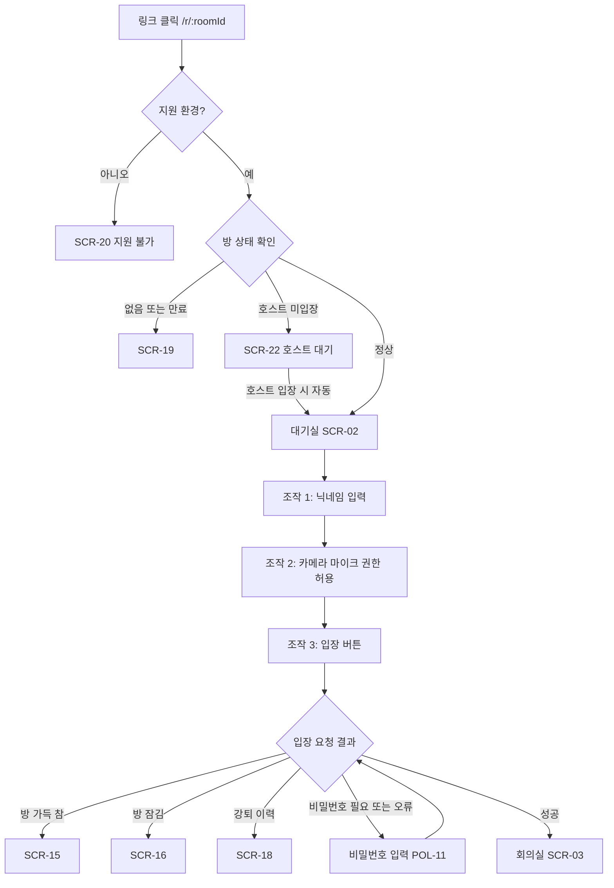
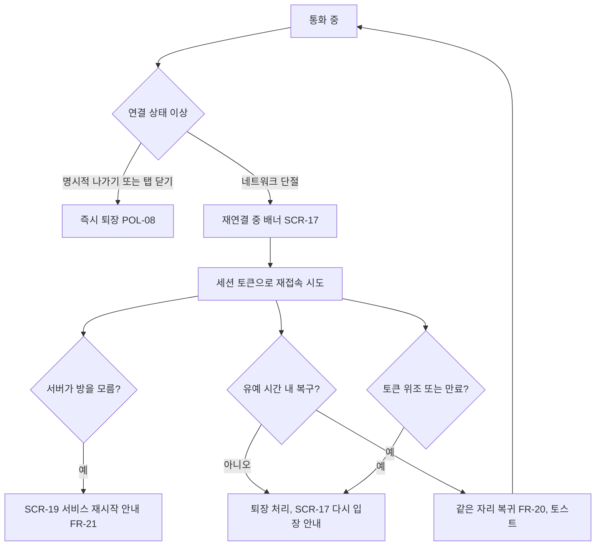
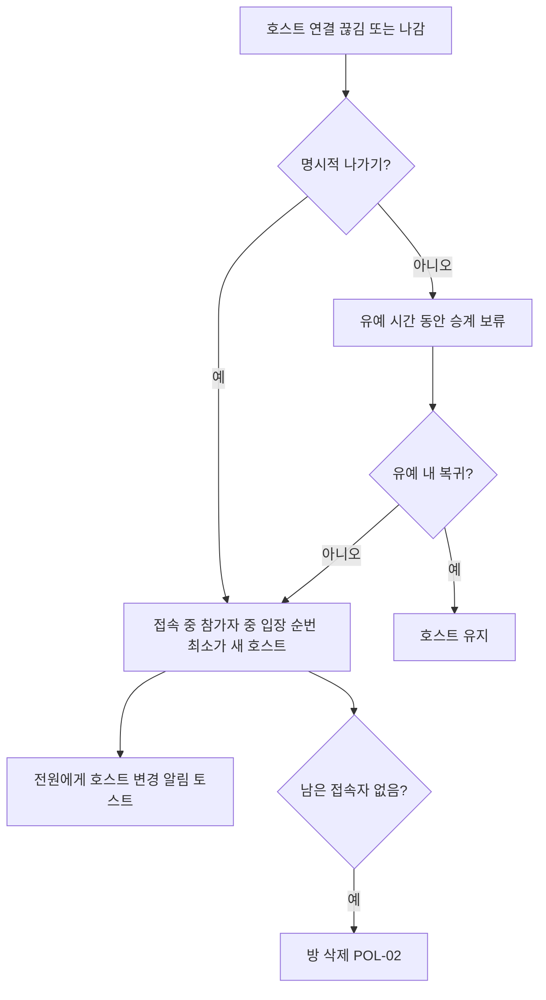
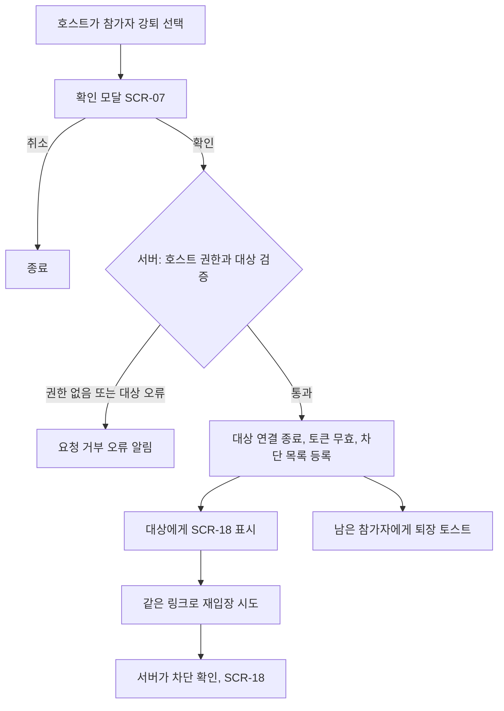
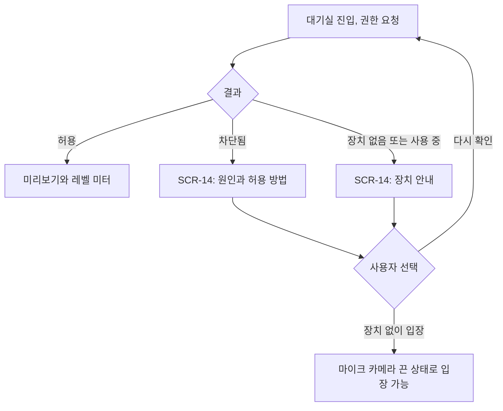
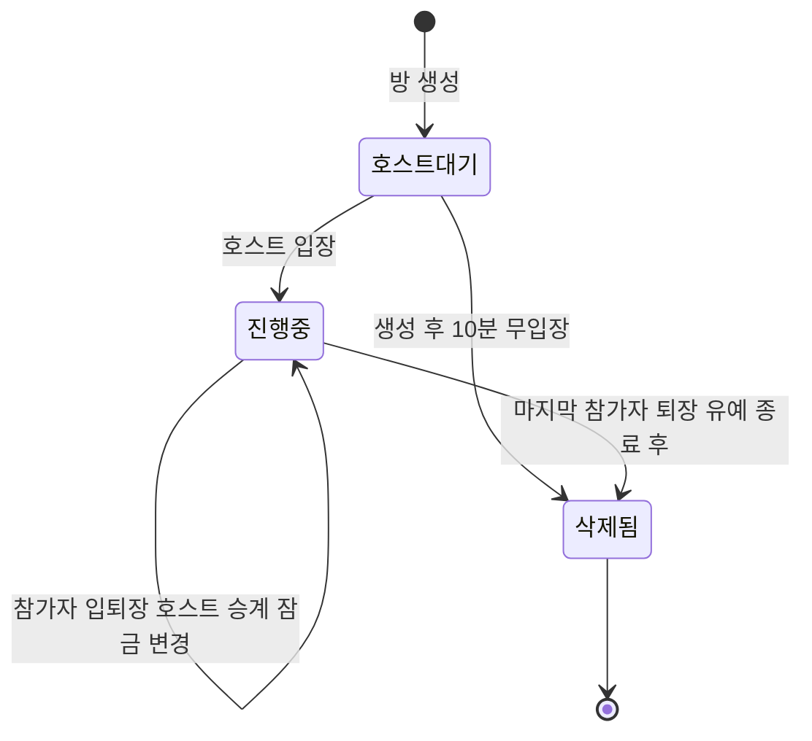
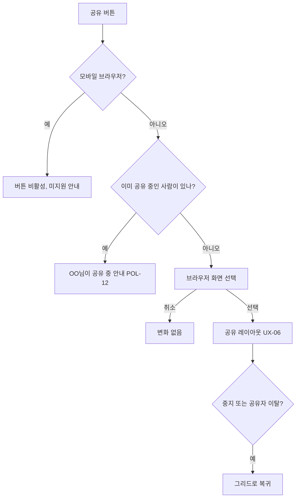

> **이 문서의 용도** — 누가: 기획자, 디자이너, 아키텍트 / 언제: 와이어프레임·시퀀스 다이어그램을 그리기 전, 흐름이 바뀔 때 / 무엇을: 화면 구조와 사용자 흐름, 방 상태 전이를 결정한다.

# 정보구조·유저 플로우 (IA/FLOW)

| 항목 | 내용 |
|---|---|
| 버전 | 0.1 |
| 작성일 | 2026-10-01 |
| 상태 | 승인 (2026-10-01, DEC-004) |
| 주도 | ① 기획자(PM) |

## 변경 이력
| 버전 | 날짜 | 내용 |
|---|---|---|
| 0.1 | 2026-10-01 | 최초 작성. mermaid 9개 블록은 mermaid 10 파서로 문법 검증 통과(시각 렌더링은 미검증) |

## 1. 정보구조(사이트맵)
URL은 두 개뿐이다. `/r/:roomId`는 방의 진행 상태에 따라 대기실, 회의실, 상태 화면을 보여 준다.

## 2. 핵심 플로우

### FLOW-01 방 생성과 공유 (P1)

- 요구: FR-01, FR-02, POL-04, POL-15

### FLOW-02 링크 입장 (P2, 성공 기준 경로)

- 비밀번호 방은 조작이 1회 늘어 4회(NFR-01). 권한 거부는 FLOW-06.
- 요구: FR-03, FR-04, FR-05, FR-06, FR-23, NFR-01, POL-01, POL-03, POL-11, POL-13

### FLOW-03 연결 끊김과 재연결 (시나리오 3)

- 요구: FR-19, FR-20, FR-21, NFR-03, POL-08

### FLOW-04 호스트 이탈과 승계

- 잠금 상태와 강퇴 목록은 승계 후에도 유지된다.
- 요구: FR-17, FR-18, POL-02, POL-05

### FLOW-05 강제 퇴장과 재입장 차단

- 요구: FR-15, POL-06, SEC-05

### FLOW-06 카메라·마이크 권한 거부

- 요구: FR-04, UX-03, E-15

### FLOW-07 방 상태 전이

- 잠금은 진행중 상태 안의 속성이다(`locked`). 잠금 중에도 유예 내 재접속은 허용한다.
- 요구: FR-18, FR-14, FR-23, POL-02, POL-03, POL-13

### FLOW-08 화면공유

- 요구: FR-12, UX-06, POL-12

## 3. 플로우–요구 매핑
| FLOW | 주요 요구 |
|---|---|
| FLOW-01 | FR-01, FR-02 |
| FLOW-02 | FR-03, FR-04, FR-05, FR-06, FR-23, NFR-01 |
| FLOW-03 | FR-19, FR-20, FR-21, NFR-03 |
| FLOW-04 | FR-17, FR-18 |
| FLOW-05 | FR-15 |
| FLOW-06 | FR-04 |
| FLOW-07 | FR-14, FR-18, FR-23 |
| FLOW-08 | FR-12, UX-06 |
