> **이 문서의 용도** — 누가: 디자이너, 기획자 / 언제: 화면 배치를 확인하거나 바꿀 때 / 무엇을: SCR별 배치를 결정(정적 목업은 구현 화면 스크린샷으로 대체, DEC-004).

# 와이어프레임과 구현 화면

| 항목 | 내용 |
|---|---|
| 버전 | 0.1 |
| 작성일 | 2026-10-01 |
| 상태 | 승인 (구현 반영, DEC-004) |
| 주도 | ③ 디자이너 |

## 변경 이력
| 버전 | 날짜 | 내용 |
|---|---|---|
| 0.1 | 2026-10-01 | 최초 작성 |


`screen-spec.md`의 SCR 정의를 기준으로 한 배치도와 **실제 구현 화면 스크린샷**(Playwright가 360px·1280px에서 촬영, `e2e/responsive.spec.ts`)이다. 정적 HTML 목업은 사용자 지시(속도 우선)에 따라 구현 화면 비교로 대체했다.

## 1. 회의실 (SCR-03) 배치
```
데스크톱(≥768px)                              모바일(<768px)
┌──────────────────────────────────────┐     ┌───────────────────┐
│ MeetLite [연결됨]        [링크 복사]  │     │MeetLite[연결됨][복][설]│
├────────────────────────────┬─────────┤     ├───────────────────┤
│  ┌──────┐  ┌──────┐        │ 사이드  │     │ ┌─────┐ ┌─────┐  │
│  │ 타일 │  │ 타일 │        │ 패널    │     │ │타일 │ │타일 │  │
│  └──────┘  └──────┘        │ 채팅/   │     │ └─────┘ └─────┘  │
│     ┌──────┐               │ 참가자  │     │    ┌─────┐       │
│     │ 타일 │               │         │     │    │타일 │       │
│     └──────┘               │         │     │    └─────┘       │
├────────────────────────────┴─────────┤     ├───────────────────┤
│ 마이크ˆ 카메라ˆ 화면공유 채팅 참가자 │나가기│     │마이크 카메라 공유 채팅 참가자│나가기│
└──────────────────────────────────────┘     └───────────────────┘
```
화면공유 중: 큰 공유 화면 + 참가자 썸네일 열(데스크톱 우측, 모바일 하단).

## 2. 구현 화면 (1280px / 360px)
| 화면(SCR) | 데스크톱 1280px | 모바일 360px |
|---|---|---|
| 랜딩(SCR-01) | 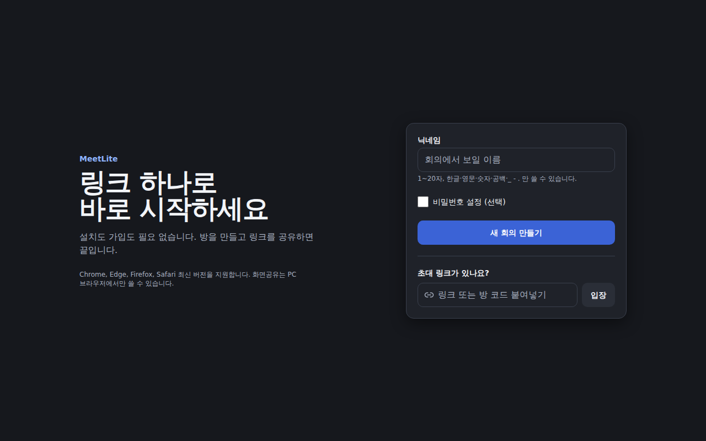 | 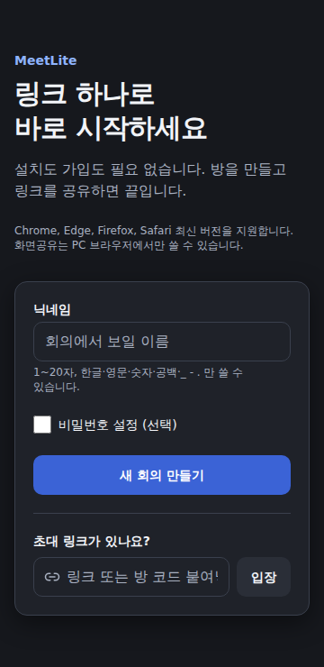 |
| 랜딩+비밀번호 | 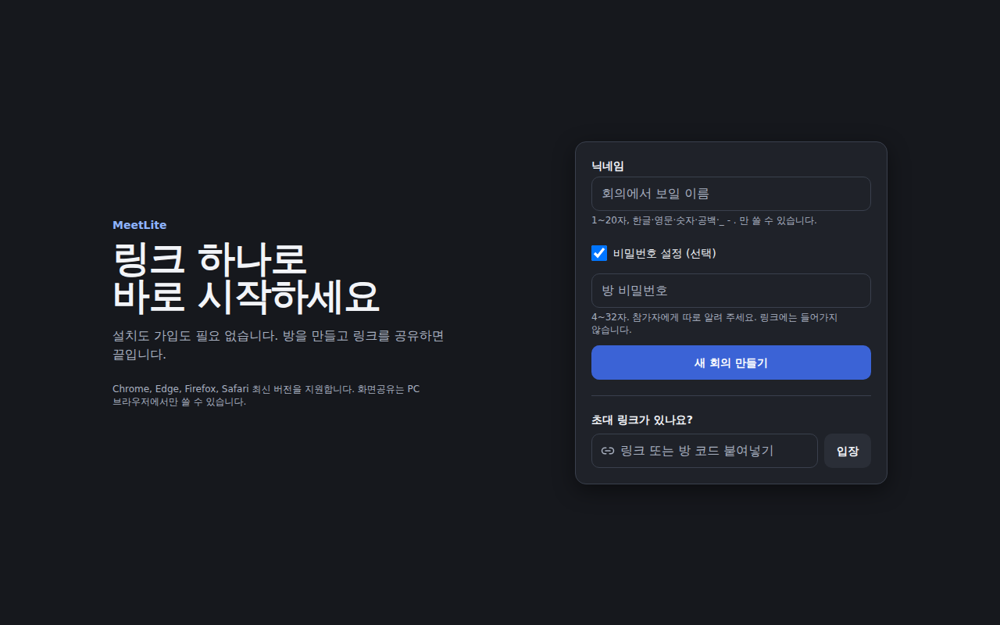 | 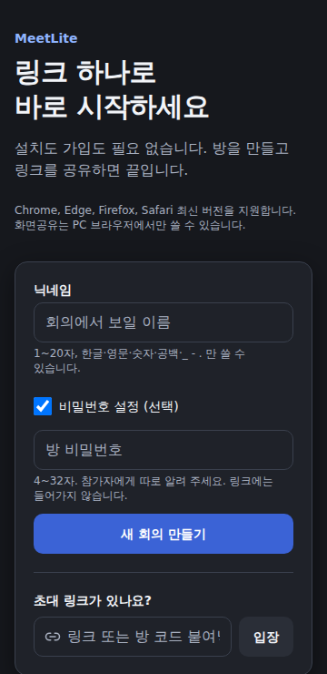 |
| 대기실(SCR-02) | 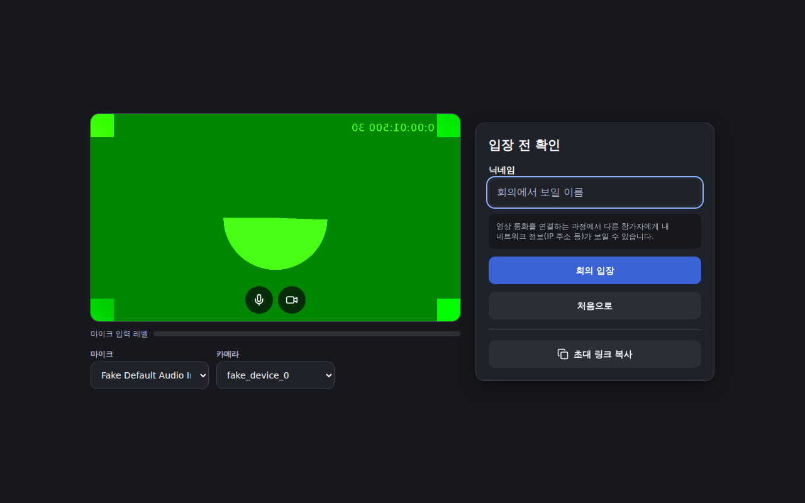 | 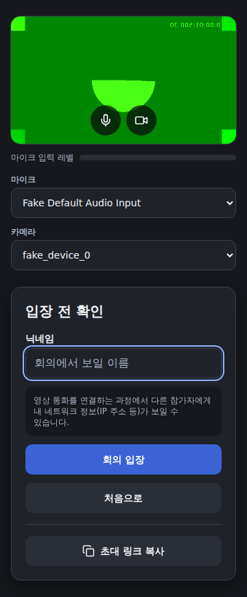 |
| 회의실 3명(SCR-03) | 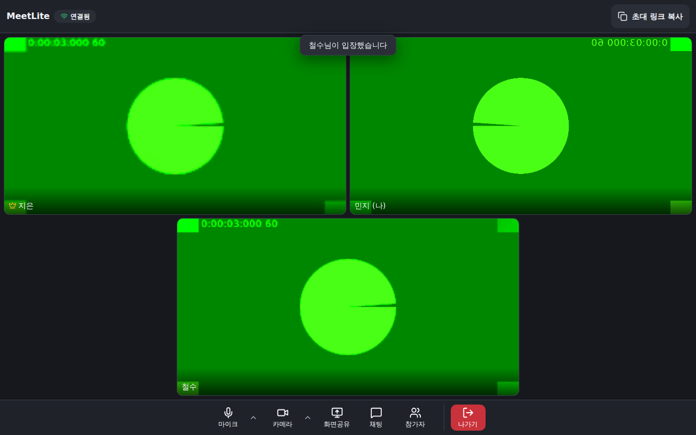 | 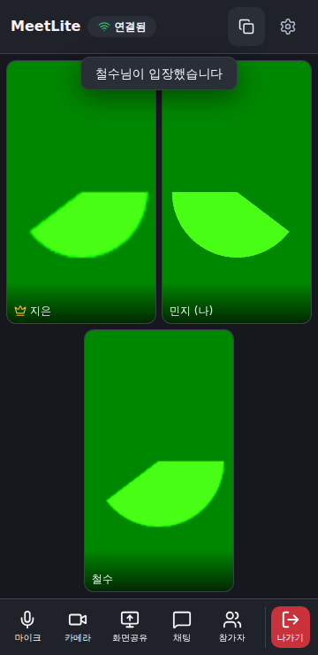 |
| 채팅 패널(SCR-04) | 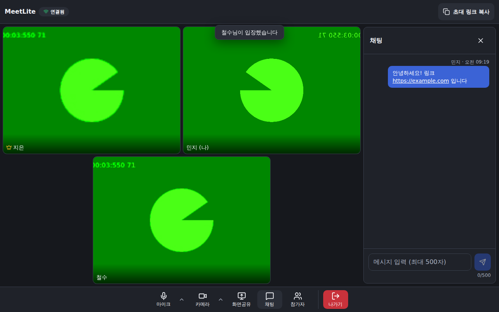 | 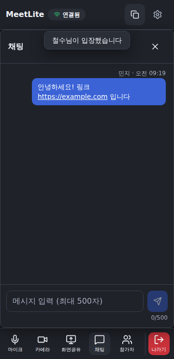 |
| 참가자 패널(SCR-05) | 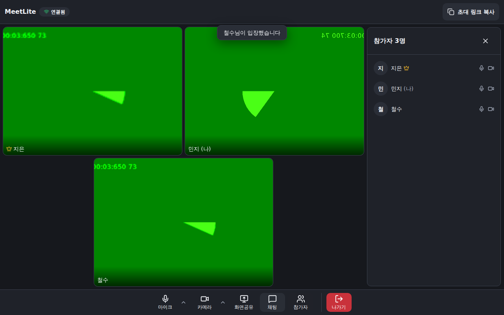 | 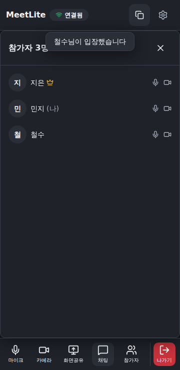 |
| 화면공유 레이아웃 | 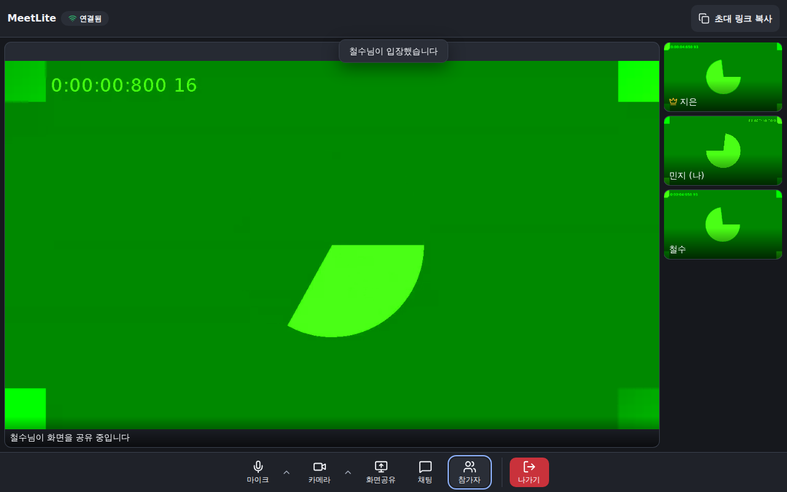 | (모바일은 공유 시작 불가) |
| 나가기 확인(SCR-07) | 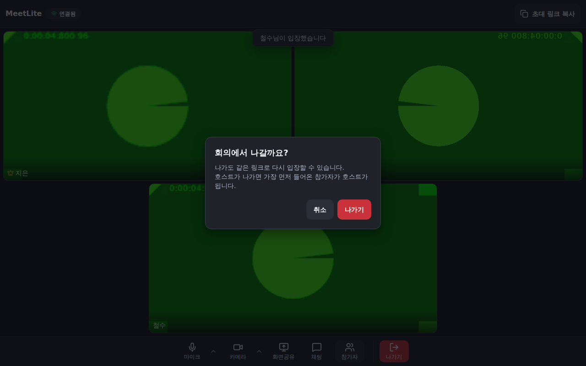 | 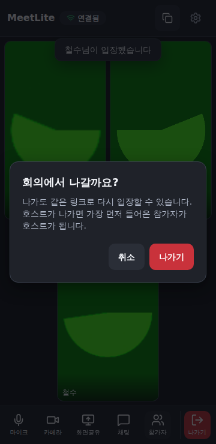 |
| 방 잠김(SCR-16) | 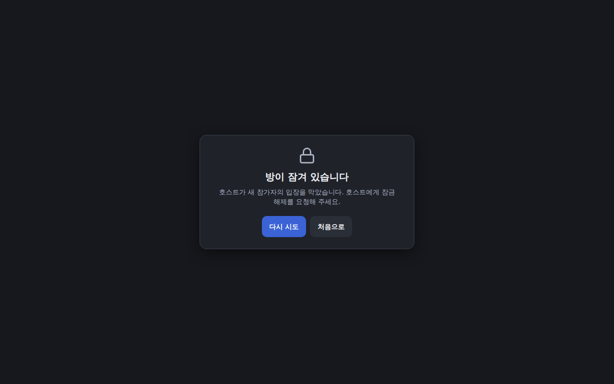 | 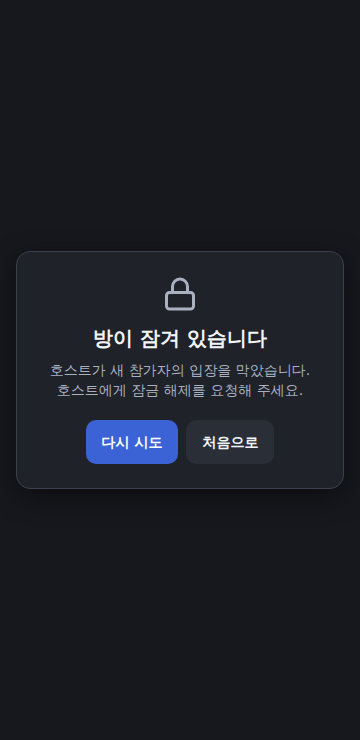 |

화면의 영상은 Chromium **가짜 카메라**(녹색 배경과 시계)다.

## 3. 상태 화면 12종 (SCR-11~22)
공통 틀 `StateScreen`(제목 + 원인 + 해결 방법 + 버튼). 문구는 `content-guide.md`, 자동 검증은 IT-06(호스트 대기), IT-05(잠김·강퇴), IT-12(없는 방), IT-15(서비스 재시작), IT-16(가득 참), IT-17(권한 거부), IT-18(지원 불가), IT-19(퇴장 완료)이다. 로딩(SCR-11)·일반 오류(SCR-13)·빈 상태(SCR-12)는 구현되어 있으나 전용 시각 캡처는 없다(**미검증: 시각**).
