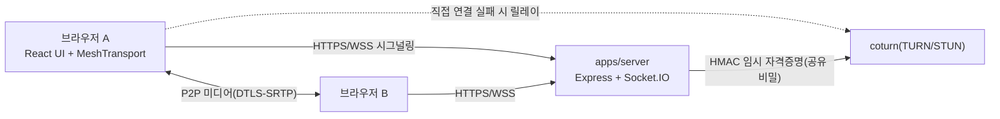
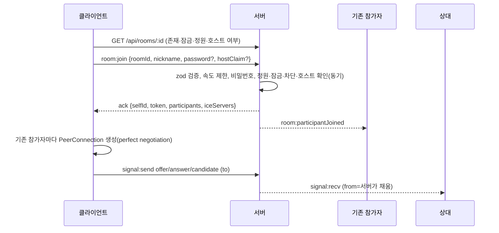
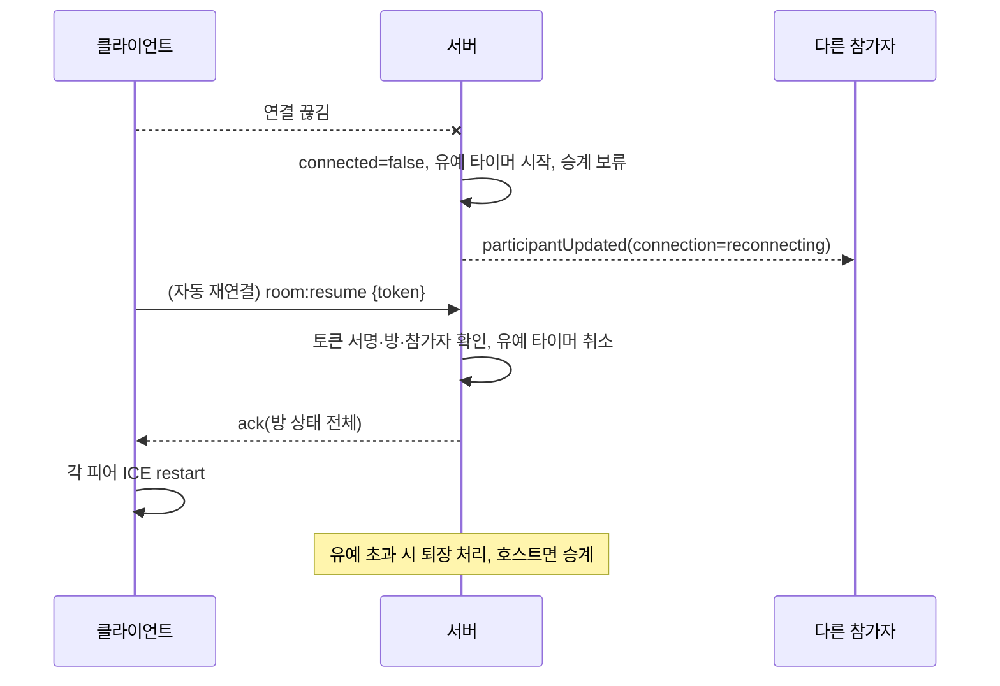

> **이 문서의 용도** — 누가: 아키텍트, 개발자 / 언제: 구조를 바꾸거나 한계를 판단할 때(SFU 전환, 용량 산정) / 무엇을: 시스템 구성, 책임, 상태 모델, 시퀀스, 성능 수치, 한계를 결정한다.

# 기술 요구사항 문서 (TRD)

| 항목 | 내용 |
|---|---|
| 버전 | 0.1 |
| 작성일 | 2026-10-01 |
| 상태 | 승인 (구현 기준, DEC-004) |
| 주도 | ④ 아키텍트, ② 개발자 |

## 변경 이력
| 버전 | 날짜 | 내용 |
|---|---|---|
| 0.1 | 2026-10-01 | 최초 작성 (구 `docs/plan.md`의 구조를 새 요구에 맞춰 대체) |

## 1. 구성

- 미디어는 브라우저끼리 직접 오간다(mesh). 서버는 시그널링, 방 상태, 자격증명 발급만 한다(NFR-07).
- 서버 1대가 API, 소켓, (선택) 웹 정적 파일까지 제공하고 coturn은 같은 서버나 별도 호스트에서 돈다(`infra-deploy.md`는 Phase 7).

## 2. 계층과 책임 (NFR-11)
| 계층 | 위치 | 책임 | 의존 방향 |
|---|---|---|---|
| room(도메인) | `apps/server/src/rooms` | 방 상태·규칙(정원, 호스트 승계, 잠금, 강퇴, 유예, 수명). 소켓·HTTP를 모른다 | 없음 |
| signaling | `apps/server/src/socket` | 소켓 연결, 입력 검증, rate limit, 권한 확인, 릴레이 | room, security |
| security | `apps/server/src/security` | 방 ID, 토큰, 비밀번호 해시, TURN 자격증명, 속도 제한, 차단 키 | 없음 |
| shared | `packages/shared` | 이벤트 이름, zod 스키마, 상수 | 없음 |
| transport | `apps/web/src/media` | `MediaTransport` 인터페이스와 `MeshTransport` | shared |
| ui | `apps/web/src/{pages,components}` | 화면, 상태 표시, 문구(`strings.ts`) | transport, shared |

`MediaTransport`(SFU 교체 지점): `connect(iceServers)`, `addPeer(id, polite)`, `removePeer(id)`, `handleSignal(from, msg)`, `setLocalStream(stream)`, `replaceVideoTrack/AudioTrack`, `setScreenStream`, 이벤트 `remoteStream`, `peerState`, `signal`(보낼 메시지). SFU로 바꾸면 이 구현체만 교체하고 방·채팅·호스트 로직은 그대로 쓴다.

## 3. 서버 상태 모델 (메모리, 단일 인스턴스)
```
Room { id, passwordHash?, locked, hostId?, hostClaimUsed, screenSharerId?, nextSeq,
       participants: Map<id, Participant>, banned: { sessions:Set, ipKeys:Set }, emptyTimer? }
Participant { id, nickname, joinSeq, ipKey, audio, video, screen, connected, graceTimer? }
```
- 한계(명시): 서버를 재시작하면 모든 방이 사라진다(NFR-06, RISK-07). 클라이언트는 `ROOM_NOT_FOUND`로 이를 알고 SCR-19를 보여 준다(FR-21). 수평 확장은 비목표.
- 동시성: Node 단일 스레드에서 입장·삭제·정원 확인을 한 동기 함수 안에서 처리한다(비밀번호 해시 비교만 `await` 앞에서 하고 이후 동기 구간에서 모든 조건을 다시 확인).

## 4. 시퀀스 (핵심 4종)
### 4.1 입장

### 4.2 재연결

### 4.3 강퇴
호스트 `host:kick` → 서버가 호스트 권한과 대상 방 소속 확인 → 대상에게 `room:kicked` 후 소켓 종료, 방에서 제거, 세션·IP 차단 키 등록 → 전원에게 `participantLeft(kicked)`. 같은 사람이 `room:join`하면 `KICKED`.
### 4.4 호스트 이탈과 승계
명시적 나가기는 즉시, 끊김은 유예 후에 호스트를 접속 중인 참가자 중 `joinSeq`가 가장 작은 사람에게 넘기고 `room:hostChanged`를 보낸다. 접속 중인 사람이 없으면 방을 삭제한다.

## 5. 성능·용량 목표 (측정은 Phase 6)
| 항목 | 목표 | 근거 |
|---|---|---|
| 방당 인원 | 6 (설정) | NFR-04 |
| 동시 방 | 30 목표 / 상한 100 | NFR-04, A-07 |
| 첫 영상까지 | 중앙값 ≤5초, p95 ≤10초 | NFR-02 |
| 시그널링 서버 메모리 | 방 100개 × 6명에서 100 MB 미만(가정, 측정 예정) | — |
| 비디오 품질 적응(NFR-13) | 인원 ≤2: 최대 720p/1.5Mbps, 3~4명: 480p/700kbps, 5~6명: 360p/400kbps | mesh 업링크 = (인원−1) × 비트레이트. 6명 360p면 5×0.4 = 약 2Mbps(가정) |
| 오디오 | 항상 우선, Opus 기본 | — |

## 6. 오류 처리·재시도
- 소켓: Socket.IO 자동 재연결(지수 백오프 상한 5초) → `room:resume`. 유예(`RECONNECT_GRACE_SEC`, 기본 20초) 초과 시 새로 입장(POL-08).
- 피어: `iceconnectionstate=failed`면 ICE restart(최대 3회), 계속 실패하면 해당 타일에 오류 표시.
- 서버: 모든 핸들러는 try/catch로 감싸 `INTERNAL`을 돌려주고 내부 정보는 로그에만(스택 제외 필드만) 남긴다. SIGTERM에서 새 연결을 막고 소켓을 닫은 뒤 종료(graceful shutdown).

## 7. 확장 한계와 SFU 전환 기준
mesh는 인원이 늘면 각자 올려야 하는 스트림이 늘어난다. 다음 중 하나가 반복되면 SFU(LiveKit 등)를 검토한다: 6명 방에서 성능 시험의 합격 기준을 넘지 못함, 6명 초과 요구, 평균 TURN 경유 비율이 높아 비용이 비정상. 전환은 `MediaTransport` 구현체 교체이며 지금은 구현하지 않는다.

## 8. 요구 매핑
| 요구 | 구성 요소 |
|---|---|
| FR-01~06, 23 | EVT-02/03/10, room 도메인, Landing/Lobby |
| FR-07~10, 12 | MeshTransport, EVT-13/15/16/17 |
| FR-11 | EVT-14/27, ChatPanel |
| FR-13~17 | Room 도메인, EVT-18~20/24/25/29 |
| FR-18~22 | Room 수명·유예, EVT-11/12 |
| NFR-08, 12 | config(zod), pino, graceful shutdown, `v` 필드 |
| NFR-11 | 계층 분리, MediaTransport |
| NFR-07 | 단일 서버 구성, 선택적 정적 파일 제공 |
