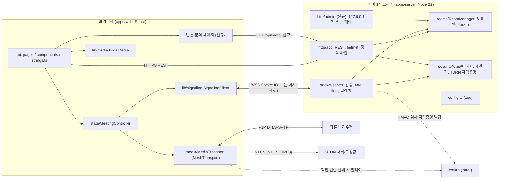
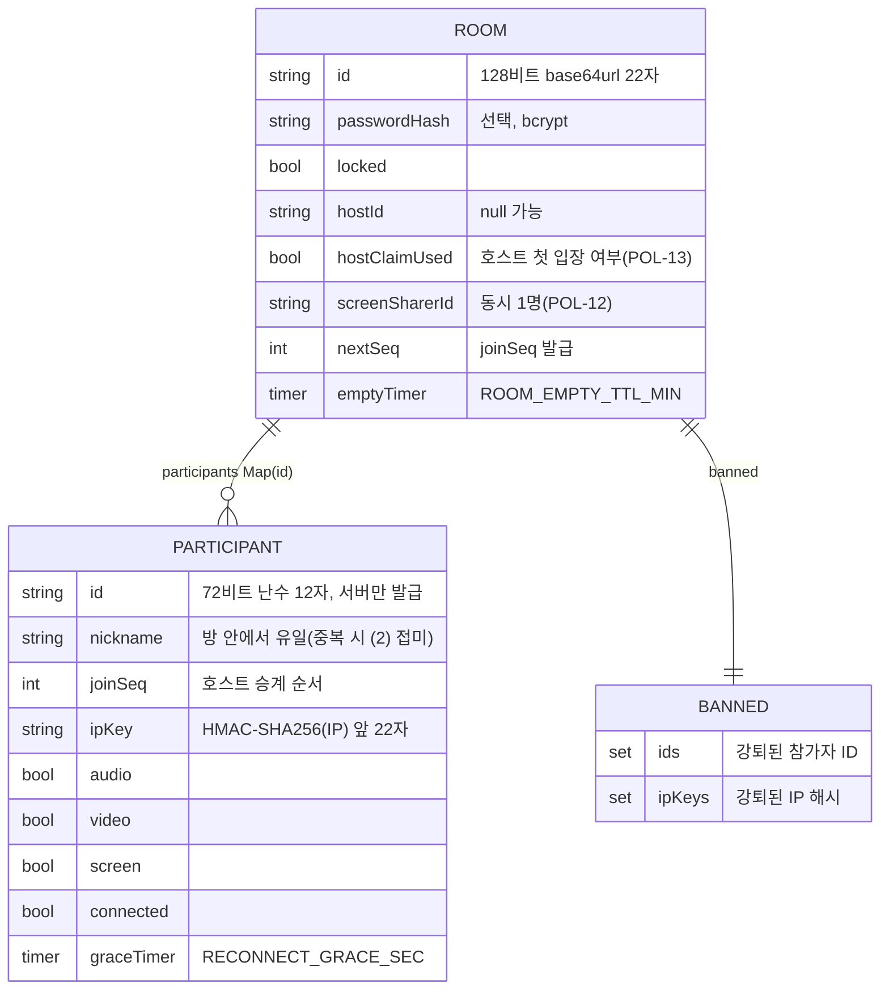

# 03 시스템 설계서 (소급) — MeetLite 하네스 4단계 이후 담당자가 현재 아키텍처를 이해하고, 신규 요구(POL-17~20, SEC-12~13, UX-13~15, NFR-14~15)를 어떤 모듈·파일에 어떻게 구현할지 결정하는 데 쓰는 문서

- 문서명: 03-system-design / 버전: v3 / 작성일: 2026-10-01 / 상태: 초안 → 검증 PASS(`verify-log_03-system-design.md`) / 주도: ④ 시스템 아키텍트
- **소급 문서(DEC-006, DEC-007)**: 서비스는 이미 구현·검증되어 있다. 1~7장의 "현재 구조"는 **코드를 직접 읽어** 쓴 것이며 기존 TRD·API 명세·위협 모델과 어긋나면 코드가 정본이다. 구현 여부는 `[구현]` / `[신규설계]`(미구현, 이 문서가 설계)로 구분한다. 이 단계에서 프로젝트 코드·`docs/01~06`은 수정하지 않았다.
- **이 단계에서 직접 실행해 확인한 것**: coturn 4.6.1(로컬 `turnserver`)과 4.9.0(도커 이미지)에 **저장소의 실제 `turnserver.conf`를 적용**하고 최소 TURN 클라이언트로 CreatePermission을 시험했다(6.3절). 그 결과 **현재 설정은 공인 IPv4 peer를 전부 거부하는 결함이 있다**(8.3절 D-1). 그 외 항목(법령 원문, coturn CVE 원문, Google STUN 약관)은 확인하지 못했고 "확인 필요"로 남겼다.
- 변경 이력은 9장.

## 1. 아키텍처 개요

### 1.1 구성

- 서버는 시그널링·방 상태·자격증명 발급만 한다. 영상·음성·화면은 브라우저끼리 P2P이며 직접 연결이 안 될 때만 coturn을 지난다(NFR-07).
- 서버 1프로세스가 REST, 소켓, (`WEB_DIST` 설정 시) 웹 정적 파일을 함께 제공한다(ADR-0005). coturn은 별도 프로세스(같은 호스트 또는 다른 호스트)다.

### 1.2 모듈 경계 [구현]

| 계층 | 위치 | 책임 | 의존 방향(import) |
|---|---|---|---|
| shared | `packages/shared/src/{limits,text,schemas,protocol,index}.ts` | 상수, 닉네임·채팅 정규화, zod 스키마(strict), 이벤트 타입. 서버·웹 공용 **단일 출처** | 없음(zod만) |
| room(도메인) | `apps/server/src/rooms/RoomManager.ts` | 정원, 호스트 승계, 잠금, 강퇴, 유예, 방 수명. 소켓·HTTP를 모르고 `onEvent` 콜백으로만 알림. 모든 변경은 동기 함수 안에서 끝남(정원 경쟁 방지) | shared, security/ids |
| security | `apps/server/src/security/{ids,token,password,rateLimit,ipKey,turn}.ts` | 방/참가자 ID, HMAC 토큰, bcrypt(SHA-256 선처리), 토큰버킷·실패제한, IP 해시, TURN 자격증명 | shared(타입), config(타입) |
| signaling | `apps/server/src/socket/{server,messages}.ts` | 소켓 연결, Origin 검사, IP 동시연결 상한, 이벤트별 rate limit·zod 검증·입장 여부 확인, 릴레이, 방 이벤트→소켓 전달 | room, security, shared |
| http | `apps/server/src/http/{app,clientIp}.ts` | REST(`/healthz`, `/api/rooms`), helmet/CSP/Permissions-Policy, CORS 허용목록, 정적 파일 | room, security, shared |
| 기반 | `apps/server/src/{config,logger,server,index}.ts` | 환경변수 zod 검증(실패 시 기동 중단), pino(redact), 조립, graceful shutdown(강제 10초) | 전부 |
| transport | `apps/web/src/media/{MediaTransport,MeshTransport}.ts` | `MediaTransport` 인터페이스(SFU 교체 지점)와 mesh 구현(perfect negotiation, ICE restart, 인원별 송신 상한) | shared |
| 세션 상태 | `apps/web/src/state/{MeetingController,useMeeting}.ts` | 소켓·방 상태·transport·로컬 장치·토스트를 묶는 컨트롤러. React와는 `subscribe/getSnapshot`으로만 연결 | transport, lib, strings |
| ui | `apps/web/src/{App,pages,components,strings,design}` | 화면, 문구(`strings.ts` 한 곳), 디자인 토큰 | state, lib |
| 인프라 | `Dockerfile`, `infra/docker-compose.yml`, `infra/coturn/turnserver.conf`, `.github/workflows/ci.yml` | 컨테이너(비루트, HEALTHCHECK), 개발용 coturn, CI(lint, typecheck, test, check:docs, audit, e2e) | — |

경계는 import 방향 관례이며 자동 강제 도구는 없다(eslint는 `dangerouslySetInnerHTML` 금지만 규칙으로 가짐). 신규 설계도 이 방향을 깨지 않는다: 도메인(`RoomManager`)에는 소켓 지식을 넣지 않고, 새 이벤트는 `RoomEvent`로 내보낸다.

### 1.3 작업 단위 확정표

02 §9의 unit-01~19를 실제 파일과 대조해 확정했다. 구현 완료 단위(01~14)는 소급 기록이며 병렬 판정은 의미가 없다. **신규 단위만 병렬 판정을 한다.** 02와 달라진 점은 8.1절.

**구현 완료(소급, 파일 경계 확정)**

| 단위 | 커버 REQ | 파일 범위(확정) | 비고(02 대비) |
|---|---|---|---|
| unit-01 공통 프로토콜 | NFR-12, SEC-04·06(스키마), POL-04·07 | `packages/shared/src/*` + `schemas.test.ts`, `text.test.ts` | 동일. 서버·웹 전 단위가 의존 |
| unit-02 서버 기반 | NFR-08, SEC-08·10, NFR-04(상한 설정) | `apps/server/src/{config,logger,server,index}.ts`, `http/{app,clientIp}.ts`, `test/{config,http}.test.ts` | `http/app.ts`에 REST 방 생성·조회(EVT-02/03)가 있음. `config.ts`·`.env.example`는 공유 자원 |
| unit-03 서버 보안 | SEC-01~03, SEC-06(제한기), SEC-09(자격증명), POL-11 | `apps/server/src/security/*`, `test/security.test.ts` | 동일(순수 함수) |
| unit-04 방 도메인 | FR-05, FR-14~18, FR-23, POL-01~03·05·06·13, SEC-05 | `rooms/RoomManager.ts`, `test/roomManager.test.ts` | 동일 |
| unit-05 서버 시그널링 | FR-03, FR-06~08, FR-11~13, FR-16, FR-19~20, SEC-04·06 | `socket/{server,messages}.ts`, `test/signaling.test.ts` | unit-04와 `RoomEvent`·`Result` 계약으로 결합 |
| unit-06 웹 시그널링·세션 | FR-01~03, FR-19~22, NFR-03 | `lib/{signaling,api,storage,useRoute}.ts`, `state/*`, `pages/RoomPage.tsx`, `App.tsx`, `main.tsx` | **`App.tsx`·`useRoute.ts`·`main.tsx` 추가**(02는 누락). `MeetingController.ts`(439줄)에 기능 집중 |
| unit-07 웹 미디어 | FR-07~10, NFR-02·13, UX-07, SEC-09(클라) | `media/*`, `lib/{media,audioLevel}.ts`, `media/MeshTransport.test.ts` | **`lib/media.ts`(LocalMedia)를 unit-08에서 이쪽으로 이동**: 장치 획득은 미디어 계층 책임이고 소비자는 06·08·17 |
| unit-08 웹 랜딩·대기실 | FR-01~04·06, NFR-01, UX-03·09 | `pages/{Landing,Lobby}.tsx`, `components/{DeviceSheet,CopyLink}.tsx` | `Landing`이 `lib/linkify.ts`(unit-10)를 import하는 의존이 있음 |
| unit-09 웹 회의실 UI | FR-07·08·10·12·19·22, UX-04~07·12 | `pages/Room.tsx`, `components/{VideoGrid,VideoTile,ControlBar,ConnectionBadge,Toasts,ConfirmModal}.tsx`, `lib/useMediaQuery.ts` | `useMediaQuery.ts` 추가 |
| unit-10 웹 채팅 | FR-11, SEC-07, POL-07 | `components/ChatPanel.tsx`, `lib/linkify.ts`(+test) | 동일 |
| unit-11 웹 참가자·호스트 도구 | FR-13~17 | `components/ParticipantsPanel.tsx` | 동일 |
| unit-12 웹 상태 화면·문구·디자인·접근성 | UX-01~03·08·10·11, NFR-09·10 | `strings.ts`, `components/{StateScreen,icons}.tsx`, `design/*`, `tailwind.config.ts`, `index.css`, `index.html`, `vite.config.ts` | `icons.tsx`·빌드 설정 추가 |
| unit-13 인프라 | SEC-09(coturn)·11, NFR-07·08 | `Dockerfile`, `.dockerignore`, `infra/*`, `.github/workflows/ci.yml`, 루트 `package.json`·lockfile·`tsconfig.base.json`·`eslint.config.js` | 루트 매니페스트·lint 설정 추가 |
| unit-14 E2E·QA | IT-01~30 등 | `e2e/*.spec.ts`, `e2e/fixtures.ts`, `playwright.config.ts`, `scripts/*` | 신규 spec은 **새 파일**로만 추가(`fixtures.ts`는 읽기 전용 취급) |

**신규(미구현 [신규설계]) — 병렬 판정 확정**

| 단위 | 커버 REQ | 선행 | 수정 모듈·파일(확정) | 공유 자원 접촉 | 병렬 판정(확정) |
|---|---|---|---|---|---|
| **unit-0 공통 선행**(신규) | (직접 커버 없음, 15·16·17·19의 전제) | 없음 | ① `packages/shared/src/{protocol,schemas}.ts`(+`schemas.test.ts`): `MetaResponse`, `room:closed`(S→C), `metrics:path`(C→S)와 스키마 ② `apps/server/src/config.ts`, `.env.example`, `test/config.test.ts`: `OPERATOR_CONTACT`, `PRIVACY_OFFICER`, `LEGAL_EFFECTIVE_DATE`, `ADMIN_PORT`, `ADMIN_TOKEN`(+상호 의존 검증) ③ `apps/web/src/strings.ts`: 신규 문구 키 네임스페이스 전부(`legalLinks`, `inApp`, `autoplay`, `background`, `state.gone.operator`) ④ 슬롯 컴포넌트 `components/LegalFooter.tsx`(링크만, 실제 링크 3개), `components/InAppNotice.tsx`(`null` 렌더 스텁)와 `pages/{Landing,Lobby}.tsx`에 각 1줄 마운트 | 4개 공유 자원 전부(아래 1.4) | **단독 선행**. 이 단위가 공유 파일 변경을 모두 끝내야 15·16·17·19가 서로 파일이 겹치지 않는다 |
| unit-15 컴플라이언스 화면·문서 | POL-17, POL-18(문서·로그 TC), POL-20, SEC-13, POL-19(신고 채널 화면) | unit-0 | 웹: `pages/Legal.tsx`(신규), `strings.ts`의 `S.legal` 블록(**이 단위만 수정**, W1에서 unit-17은 strings.ts를 건드리지 않는다), `App.tsx`, `lib/useRoute.ts`, `lib/api.ts`(`getMeta`). 서버: `http/app.ts`(`GET /api/meta`), `logger.ts`(`createLogger(level, stream?)`), `security/rateLimit.ts`(제한기 정기 정리, D-6). 신규 테스트: `test/{meta,logPrivacy}.test.ts`, `src/legal.test.ts`, `e2e/legal.spec.ts`; 기존 `test/security.test.ts`에 정리 TC 추가. 스크립트: `scripts/license-report.mjs`(신규, 의존성 추가 없음) | `http/app.ts`는 unit-02 파일이나 신규 단위 중 이 단위만 수정 | **unit-17·18·20과 병렬 가능**(파일 교집합 없음, 1.5 표). 법률 문구 확정은 사용자·법률 검토가 선행되어야 `reviewed`로 바뀜(코드 작업은 `draft`로 진행 가능) |
| unit-17 인앱·iOS·자동재생 UX | UX-13, UX-14, UX-15 | unit-0 | 웹: `lib/inApp.ts`(신규)+test, `state/foreground.ts`(신규)+test, `state/useForeground.ts`(신규), `state/MeetingController.ts`(`onForeground`, 미디어 정합), `lib/media.ts`(`LocalMedia.reconcile`), `lib/signaling.ts`(`request` 선택적 timeout), `components/{InAppNotice,VideoTile}.tsx`, `pages/{Room,RoomPage}.tsx`. 신규: `e2e/mobile-lifecycle.spec.ts` | `MeetingController.ts`, `RoomPage.tsx`(후속 16·19와 충돌) | **unit-15·18·20과 병렬 가능**. unit-16·19와는 **직렬**(`MeetingController.ts`, `RoomPage.tsx` 공유) |
| unit-18 coturn 검증·하드닝 | SEC-12, POL-18(coturn 로그 설정) | 없음 | `infra/coturn/turnserver.conf`(D-1 수정, 주석 정정), `infra/docker-compose.yml`(로그 로테이션), `.github/workflows/ci.yml`(coturn 점검 job). 신규: `apps/server/test/{coturnConfig,coturnLive,turnProbe}.ts` | `ci.yml`, `infra/*`(unit-13 파일)이나 신규 단위 중 이 단위만 수정 | **완전 독립. 가장 먼저 착수 권장**(D-1이 운영 TURN을 무력화) |
| unit-16 운영자 방 폐쇄·신고 운영 | POL-19(폐쇄 수단·절차) | unit-0, 파일 충돌로 unit-17 이후 | 서버: `http/admin.ts`(신규), `server.ts`(admin 리스너 조립·종료), `rooms/RoomManager.ts`(`closeByOperator`, `RoomEvent 'closed'`), `socket/server.ts`(`room:closed` 전달·소켓 정리). 웹: `state/MeetingController.ts`(`room:closed`→`end('operator')`, `EndReason`), `pages/RoomPage.tsx`(`gone` 사유 매핑). 신규 테스트: `test/admin.test.ts`, roomManager/signaling 테스트 추가, `e2e/operator-close.spec.ts` | `socket/server.ts`(19와), `MeetingController.ts`·`RoomPage.tsx`(17과) | **직렬(W2)**: 논리 의존은 unit-0뿐이나 파일 충돌로 17 이후, 19 이전 |
| unit-19 relay 계측·KPI 로그 | NFR-15, KPI-01·04·05 | unit-0, unit-16, unit-17 | `media/{MediaTransport,MeshTransport}.ts`(`pathType` 이벤트, relay 판정), `state/MeetingController.ts`(보고), `socket/server.ts`(`metrics:path` 핸들러, 입장 거부·재접속 결과 로그). 테스트: `MeshTransport.test.ts`, `signaling.test.ts` 추가 | `socket/server.ts`, `MeetingController.ts`, `MediaTransport.ts` | **직렬(W3)** |
| unit-20 mesh 실측 절차(NFR-14, 신규) | NFR-14 | 없음 | `docs/05-qa/performance-test.md`(측정 절차·합격 표), 필요 시 `scripts/` 아래 신규 샘플러. **측정값은 사용자 실기기 수행 후 기입(이 단계에서 수치를 만들지 않는다)** | `performance-test.md` 단독 소유 | **완전 독립(W0 병렬)**. 02의 unit-19에서 분리 |

### 1.4 공유 파일 목록(여러 단위가 함께 고치는 파일)

| 공유 파일 | 건드리는 단위 | 처리 |
|---|---|---|
| `packages/shared/src/{protocol,schemas}.ts` | 15(`MetaResponse` 사용), 16(`room:closed`), 19(`metrics:path`) | unit-0에서 **한 번에** 추가 |
| `apps/server/src/config.ts`, `.env.example`, `test/config.test.ts` | 15(연락처), 16(admin) | unit-0에서 한 번에 추가 |
| `apps/web/src/strings.ts` | 15, 16, 17 | unit-0가 짧은 UI 키를 먼저 만들고 15·16·17은 참조만. 긴 법률 본문 블록 `S.legal`은 unit-15만 추가(같은 파일 안 다른 블록이며 W1에서 수정자가 1명). 문구를 한 파일에 두는 규칙(UX-01, TC-213)을 지키려고 파일을 나누지 않았다 |
| `pages/Landing.tsx`, `pages/Lobby.tsx` | 15(법률 링크), 17(인앱 안내) | unit-0가 슬롯 컴포넌트 마운트를 먼저 넣는다. 이후 15·17은 슬롯 컴포넌트 파일만 고친다 |
| `state/MeetingController.ts`, `pages/RoomPage.tsx` | 16, 17, 19 | **직렬화**(17 → 16 → 19) |
| `socket/server.ts` | 16, 19 | **직렬화**(16 → 19) |
| `package.json`, `package-lock.json` | 없음 | **어느 단위도 의존성을 추가하지 않는다**(2.3). 필요해지면 그 단위가 멈추고 보고(DEC-005, SEC-11) |
| `docs/05-qa/{release-checklist,test-cases}.md`, `docs/harness/traceability.md`, `docs/04-security/privacy.md`, `docs/06-ops/runbook.md`, `docs/03-engineering/observability.md` | 거의 전부 | 병렬 단위는 **자기 신규 파일만** 쓰고, 이 공유 문서는 웨이브 종료 시 오케스트레이터/11단계가 한 번에 통합(동시 편집 충돌 방지) |

unit-0을 두는 이유: 공유 변경이 소수 파일에 몰려 있고, 한 단위가 먼저 끝내면 나머지가 파일 단위로 갈라진다. 경계를 병렬을 위해 자른 것이 아니라 **타입·설정·문구가 원래 공용 자원**이어서 그 변경을 앞으로 뺀 것이다.

### 1.5 웨이브(병렬 계획 초안, 오케스트레이터가 DEC-003 P1로 확정)

| 웨이브 | 단위 | 동시 수 | 근거 |
|---|---|---|---|
| W0 | unit-0 ∥ unit-18 ∥ unit-20 | 3 | 서로 파일 교집합 없음: 0={shared, config, strings, 슬롯}, 18={infra, ci, test/coturn*}, 20={performance-test.md} |
| W1 | unit-15 ∥ unit-17 | 2 | 15={Legal, App, useRoute, api, strings.ts의 S.legal 블록, http/app, logger, security/rateLimit, 신규 테스트}, 17={inApp, foreground, MeetingController, media, signaling, VideoTile, Room, RoomPage}. 교집합 ∅(Landing·Lobby·strings는 unit-0이 끝낸 뒤라 읽기만) |
| W2 | unit-16 | 1 | 17 이후(`MeetingController`, `RoomPage`) |
| W3 | unit-19 | 1 | 16·17 이후(`socket/server.ts`, `MeetingController`) |

P1(동시 최대 4)을 다 채우지 않는다. 억지 병렬은 공유 파일 충돌을 만든다. 병렬은 한 게이트/Phase 안에서만(DEC-003).

### 1.6 TC·IT 후보 (제안 번호, 5~7단계가 `test-cases.md`·`integration-test.md`에 확정 등록)

기존 최대 번호(TC-245, IT-30, MC-05, UAT-07) 다음부터 쓴다. 번호는 충돌 방지용 제안이며 확정은 등록하는 단계의 몫이다.

| 단위 | 단위 TC | 통합·수동 |
|---|---|---|
| unit-0 | TC-301 config(`ADMIN_PORT`↔`ADMIN_TOKEN` 상호 필수, `OPERATOR_CONTACT` 형식, 운영에서 `change-me` 거부), TC-302 shared 스키마(`metrics:path` strict, `MetaResponse`) | — |
| unit-15 | TC-310 `/api/meta`(값 있음/없음, 호스트명만 노출), TC-311 `S.legal` 필수 섹션 구조, TC-312 로그 비식별(`logPrivacy`), TC-313 제한기 정기 정리(D-6) | IT-31 랜딩·대기실 법률 링크 노출과 3개 페이지 열림(E2E), MC-06 `license-report` 산출 확인 |
| unit-17 | TC-320 `detectInApp` UA 샘플표, TC-321 `decideForeground`, TC-322 `LocalMedia.reconcile` | IT-32 복귀 이벤트 → 5초 이내 재연결 상태 → 같은 `selfId` 복구, IT-33 자동재생 거부 → 탭 재생, UAT-04·05 실기기(미수행) |
| unit-18 | TC-330 L1 정적 점검, TC-331 L2 양성 대조군(공인 IPv4 허용), TC-332 L2 사설·루프백 거부, TC-333 L2 IPv4-mapped 비성공, TC-334 `user-quota`(선택) | IT-34 CI의 coturn job(실제 설정 파일 사용) |
| unit-16 | TC-340 admin 인증·바인딩·기본 비활성, TC-341 `closeByOperator` 도메인, TC-342 `room:closed` 전달·소켓 정리 | IT-35 운영자 폐쇄 E2E(클라이언트 `gone/operator`) |
| unit-19 | TC-350 `metrics:path` 스키마·핸들러·로그 필드 한정, TC-351 relay 판정(`MeshTransport` 단위), TC-352 KPI 로그 이벤트 | IT-36 TURN 경유 시 `relay` 보고(IT-21 확장) |
| unit-20 | — | MC-07 실측 절차 수행 기록(사용자 실기기, 값은 측정 후 기입) |

## 2. 기술 스택 선정 및 근거

### 2.1 스택 [구현] — 변경 없음

| 영역 | 선택(실제 버전 범위는 `package.json`) | 근거(요구 연결) | 호환성·메모 |
|---|---|---|---|
| 런타임 | Node >= 22, TypeScript strict, npm workspaces | NFR-11, CLAUDE.md 스택 고정 | `engines`, CI Node 22 |
| 서버 | Express 5, Socket.IO 4(WebSocket 전용, 폴링 없음), zod 4, helmet 8, pino 10, bcryptjs | SEC-03·06·08·10, FR-02·07. WebSocket 전용은 ADR-0006(단일 인스턴스라 sticky 불필요, 폴링 오버헤드 제거) | bcryptjs는 순수 JS라 네이티브 빌드가 없다(비용 10, SHA-256 선처리로 72바이트 절단 방지) |
| 웹 | React 19, Vite 8, Tailwind 3.4(토큰을 TS 설정으로 읽기 위해), lucide-react | UX-01·08, NFR-09·10 | 라우터 라이브러리 없음(경로가 `/`, `/r/:id`뿐이라 history API 직접 사용, `useRoute.ts`). 신규 정적 경로 3개를 더해도 라이브러리는 추가하지 않는다 |
| 미디어 | WebRTC mesh, perfect negotiation, ICE restart, `MediaTransport` 인터페이스 뒤 | FR-07, NFR-13, ADR-0001. 6명 이하·서버 1대·비용 최소 | SFU는 비목표. 교체 지점만 유지 |
| NAT 통과 | STUN + coturn(`use-auth-secret`) | SEC-09, FR-07 | coturn 이미지 `coturn/coturn:4.9`(부동 태그) |
| 테스트·CI | Vitest, Playwright(Chromium fake media), GitHub Actions | CLAUDE.md | 로컬 `turnserver`로 IT-21/22 수행 중(설정 파일은 쓰지 않음 → D-1을 못 잡음) |

### 2.2 외부 데이터·API 약관 확인표

| 외부 대상 | 용도 | 약관·한도 확인 | 상태 |
|---|---|---|---|
| Google 공개 STUN `stun:stun.l.google.com:19302`(`STUN_URLS` 기본값) | 클라이언트 공인 주소 확인(ICE srflx) | **이용약관·호출 한도·상업적 이용 허용 여부를 확인하지 못했다**(1단계도 원문 미열람, 이 단계도 공식 문서에 접근하지 않음). SLA가 없는 공개 서비스라는 점은 일반 지식이며 근거 문서는 없다 | **확인 필요**. 영향: 차단·중단 시 srflx 후보가 사라져 직접 연결 성공률이 떨어지고 TURN으로 폴백. 또한 브라우저 IP가 Google에 전달됨(POL-17 고지·국외 이전 판단 쟁점) |
| 자체 coturn(STUN 겸용, 3478) | 같은 용도 | 직접 운영(외부 약관 없음) | **권고(미확정)**: 운영에서는 `STUN_URLS=stun:<자체 coturn>:3478`로 두면 약관 불확실성과 제3자 IP 전달이 함께 사라진다. 개발 기본값은 편의상 유지. 결정은 배포 대상 확정 후 사용자(8.5 Q2) |
| 외부 폰트·분석·광고·CDN | — | 코드에서 로드하는 외부 리소스를 찾지 못했다(`index.html`·`index.css`·`tailwind.config.ts` grep 0건) | 해당 없음. 단 CSP가 `fonts.googleapis.com`·`fonts.gstatic.com`을 허용하고 있어 실제 사용보다 넓다(8.3 D-3, 제안) |
| 법령·coturn CVE·경쟁사 자료 | 설계 근거 | 원문 미열람(1단계 R-2) | **확인 필요**: 2~7장의 법령 관련 서술은 전부 "법률 검토 전 가정"이다 |

### 2.3 의존성·라이선스

- **이 설계는 새 의존성을 추가하지 않는다.** 신규 기능은 Node 내장(`node:dgram`, `node:crypto`)과 기존 패키지로 구현한다(예: SEC-12 probe는 내장 UDP로 직접 작성, 라이선스 스캔은 `node_modules/*/package.json`을 읽는 스크립트). 구현 중 의존성이 필요해지면 그 단위는 멈추고 사전 보고한다(DEC-005 재발 방지, SEC-11).
- 기존 의존성 라이선스는 `dev-guide.md` §5의 `license-checker` 요약(MIT 대다수, ISC·Apache-2.0·BSD, 소수 MPL-2.0·CC-BY-4.0·BlueOak-1.0.0·0BSD, GPL류 미확인)을 인용한다. 이 단계에서 재스캔하지 않았다. 자동 산출물(`license-report`)과 프로젝트 라이선스 결정은 SEC-13(unit-15)·사용자 결정이다.
- coturn은 BSD 계열로 알려져 있으나 이 단계에서 라이선스 원문을 확인하지 않았다(**확인 필요**, 배포 시 NOTICE 포함 여부와 함께 SEC-13).

## 3. 데이터 모델

**영속 DB는 없다(ADR-0002, DEC-007).** 모든 상태는 서버 프로세스 메모리이며 프로세스가 끝나면 사라진다. 이 한계는 의도다: 서버 저장을 최소화해야 개인정보 부담(POL-09)과 운영 복잡도가 줄고, 단일 인스턴스(수평 확장 비목표)라 일관성 문제가 생기지 않는다.

### 3.1 서버 메모리 엔티티 [구현] (`rooms/RoomManager.ts`)

수명과 불변식:

| 항목 | 규칙 |
|---|---|
| 방 생성 | `MAX_ROOMS`(기본 100) 초과 시 `SERVER_BUSY`. 생성 직후 빈 방 타이머(기본 10분)가 시작되고 첫 입장 시 해제 |
| 방 삭제 | 마지막 참가자 퇴장 즉시, 또는 빈 방 타이머 만료. 삭제 시 `banned`·`passwordHash`·닉네임·`ipKey`도 함께 사라진다 |
| 정원 | `MAX_PARTICIPANTS`(기본 6, 설정 상한 12). 확인과 삽입이 한 동기 함수(`join`) 안이라 경쟁이 없다. **설계 검증은 6명까지**이며 7~12는 품질 미검증(5.2) |
| 호스트 | 방 생성자의 `hostClaim` 토큰을 가진 첫 입장자만 호스트. 그 전에는 다른 사람이 입장할 수 없다(`HOST_NOT_PRESENT`). 호스트 이탈 시 접속 중인 사람 중 `joinSeq`가 가장 작은 사람이 승계 |
| 강퇴 | `ids`와 `ipKeys` 모두 기록. 같은 IP 해시는 `KICKED`로 거부. **같은 IP를 쓰는 다른 사람(CGNAT·사내망)도 막힐 수 있다**(8.3 D-4, 수용된 한계) |
| 재접속 유예 | 연결이 끊기면 `connected=false`, 유예 타이머 후 `removeParticipant(timeout)`. 유예 안에 `room:resume`이 오면 같은 자리 복구 |

### 3.2 토큰·자격증명 [구현] (`security/token.ts`, `security/turn.ts`)

| 종류 | 형식 | 내용 | 유효 | 저장 |
|---|---|---|---|---|
| 세션 토큰 | `base64url(payload).base64url(HMAC-SHA256(SESSION_SECRET))` | `{t:'s', rid, pid, exp}` | 4시간 | **서버 저장 없음**(무상태 검증). 클라이언트는 `MeetingController` 메모리에만 보관(새로고침하면 소멸, ADR-0003) |
| 호스트 클레임 | 같은 방식 | `{t:'h', rid, exp}` | 1시간, 첫 호스트 입장에 1회 | 클라이언트 `sessionStorage`(`meetlite:host:<roomId>`) |
| TURN 자격증명 | `username=<만료UNIX초>:<참가자ID>`, `credential=base64(HMAC-SHA1(TURN_SECRET, username))` | coturn `use-auth-secret` 방식 | `TURN_TTL_SEC`(기본 3600) | 저장 없음. 참가자 1명의 모든 PeerConnection이 같은 username을 쓴다 |

토큰 검증은 서명(`timingSafeEqual`)·형식·만료·종류·방을 확인하고, 재접속은 추가로 참가자가 방에 남아 있는지 `RoomManager`가 확인한다. 서버는 토큰 폐기 목록이 없다: 강퇴·퇴장은 참가자 삭제로 무효화된다.

### 3.3 제한기·연결 맵 [구현]

**IP 키의 단위(11단계 정정, 9단계 DEF-09-01)**: 아래 표의 "IP" 키는 원본 주소가 아니라 `clientIp()`(`http/clientIp.ts`)가 정규화한 값이다 — **IPv4는 주소 그대로, IPv4-mapped IPv6(`::ffff:a.b.c.d`)는 IPv4로, 그 밖의 IPv6는 /64 접두(상위 4그룹)**. 강퇴 차단 키(`ipKey`)도 같은 값의 HMAC 해시다. 프록시 뒤에서는 `TRUST_PROXY`번째 `X-Forwarded-For`(오른쪽부터)를 쓴다.

| 이름 | 위치 | 키 | 규칙 | 정리 |
|---|---|---|---|---|
| `createLimiter` | `http/app.ts` | IP | 방 생성 10회/분(용량 10, 분당 보충 10) × `RATE_LIMIT_SCALE` | 키 5만 초과 시 10분 미사용 키 삭제 |
| `statusLimiter` | `http/app.ts` | IP | 방 상태 조회 60회/분 | 동일 |
| `joinByIp` | `socket/server.ts` | IP | 입장 시도 용량 30, 초당 0.5 | 동일 |
| `passwordAttempts` | `socket/server.ts` | `IP|roomId` | 10분 안에 5회 실패 → 10분 차단 | 성공 시 삭제, 5만 초과 시 정리 |
| `ipConnections` | `socket/server.ts` | IP | 동시 소켓 `IP_MAX_CONNECTIONS`(기본 20). **Socket.IO 연결(CONNECT) 완료 뒤에만 센다 — CONNECT 패킷 없이 엔진 WebSocket만 여는 연결은 세지 않는다**(9단계 DEF-09-02, 미수정 → 프록시 `limit_conn` 필요, runbook §12) | 연결 종료 시 감소 |
| 이벤트별 `TokenBucket` | 소켓마다 | 이벤트명 | `RATE_SPECS`(예: `signal:send` 120/40, `chat:send` 5/1.67, `room:join` 5/0.1) | 소켓 수명 |
| strike | 소켓마다 | — | 10초 안에 15회 거부(rate limit·잘못된 페이로드·미입장) → 연결 종료(POL-10) | — |
| `sockets` | `socket/server.ts` | `roomId:pid` | 참가자 ID에 묶인 현재 소켓. 재접속 시 이전 소켓을 끊고 교체 | 연결 종료 시 삭제 |

### 3.4 공유 메시지 스키마 [구현] (`packages/shared/src/schemas.ts`, zod strict)

| 스키마 | 필드(제약) |
|---|---|
| 공통 | `v: 1`(리터럴, NFR-12). `RoomIdSchema=/^[A-Za-z0-9_-]{22}$/`, `ParticipantIdSchema=/^[A-Za-z0-9_-]{8,24}$/`, `TokenSchema` 길이 20~512 |
| `CreateRoomRequest` | `{v, password?(4~32)}` |
| `JoinRequest` | `{v, roomId, nickname(원문 ≤80, 정규화 후 1~20자·한글/영문/숫자/공백/`_-.`·제어문자 제거), password?, hostClaim?}` |
| `ResumeRequest` | `{v, token}` |
| `SignalRequest` | `{v, to, description?{type:'offer'|'answer', sdp ≤16384} | candidate?{candidate ≤2048, sdpMid?, sdpMLineIndex?, usernameFragment?}}`, 둘 중 **정확히 하나** |
| `ChatSendRequest` | `{v, text 1~2000(원문), 정규화 후 1~500 코드포인트}` |
| `MediaState` / `Lock` / `Kick` / `Empty` | `{v, audio, video}` / `{v, locked}` / `{v, targetId}` / `{v}` |
| 서버→클라이언트 | `room:participantJoined/Left/Updated`, `room:hostChanged`, `room:locked`, `signal:recv`(`from`은 서버가 채움), `chat:message`(`from`, `nickname`은 서버가 채움), `host:muteAll`, `room:kicked`. 전부 `v:1` |

strict 스키마라 클라이언트가 `from` 같은 필드를 보내면 `INVALID_PAYLOAD`다(SEC-04). 크기 상한: Socket.IO `maxHttpBufferSize` 32KB, JSON 본문 2KB.

### 3.5 클라이언트 상태 [구현]

`MeetingState`(`state/MeetingController.ts`): `status`(`idle`→`joining`→`live`⇄`reconnecting`→`ended`), `endReason`(`left|kicked|expired|closed|restarted`), `selfId`, `hostId`, `locked`, `participants[]`, `remote{id:{camera?,screen?,state}}`, `chat[]`(최근 200개), `unread`, `micOn/camOn/sharing`, `quality`, `graceSec`, `reconnectingSince`, `toasts`. 브라우저 저장: `localStorage meetlite:nickname`(마지막 닉네임), `sessionStorage meetlite:host:<roomId>`(호스트 클레임, 입장 후 삭제). 둘 다 접근 실패를 try/catch로 무시한다.

### 3.6 신규 데이터 [신규설계]

| 항목 | 정의 | 저장·수명 |
|---|---|---|
| 운영자 설정 | `OPERATOR_CONTACT`(이메일 또는 `https://` URL, ≤200자), `PRIVACY_OFFICER`(≤100자), `LEGAL_EFFECTIVE_DATE`(`YYYY-MM-DD`), `ADMIN_PORT`(1~65535, `PORT`와 같으면 거부), `ADMIN_TOKEN`(≥32자) — 전부 **선택**, 둘은 함께만 허용. zod 검증은 `config.ts` | 환경변수만. 코드에 연락처를 하드코딩하지 않는다 |
| `MetaResponse` | `{v:1, operator:{contact:string\|null, privacyOfficer:string\|null}, legal:{effectiveDate:string\|null}, network:{stunHosts:string[], turnHosts:string[]}}`. `stunHosts/turnHosts`는 `STUN_URLS/TURN_URLS`에서 **호스트명만** 뽑는다(이미 클라이언트에 전달되는 값). `stun:`·`turn:` URI는 `URL` 파서로 호스트가 나오지 않으므로 스킴(`stun|stuns|turn|turns`)과 `//`를 떼고 대괄호 IPv6를 포함한 호스트까지만 자르는 순수 함수로 구현하고 포트·`?transport=`는 버린다(TC-310에 케이스 포함) | 요청 시 계산, 저장 없음 |
| 법률 문구 | `strings.ts`의 `S.legal = {status:'draft'\|'reviewed', privacy, terms, contact}`. 각 문서는 `{title, sections[{id, heading, paragraphs[], slot?}]}`, `slot ∈ {contact, officer, effectiveDate, networkHosts}`는 `MetaResponse` 값이 들어갈 자리 | 소스(빌드 산출물). 게시본의 정본은 이 파일이고 `docs/04-security/legal-drafts/*`는 검토용 사본이다 |
| relay 보고 | `metrics:path` `{v:1, path:'direct'\|'relay'}` — 참가자 ID·IP·시각 없음 | 서버가 로그 한 줄로만 기록(`peer path`), 카운터·DB 없음 |
| 방 폐쇄 | 메모리의 방을 삭제하는 **동작**일 뿐 새 저장 데이터가 없다 | 감사 로그 한 줄(`operator action`, 방 ID 앞 6자) |

### 3.7 마이그레이션 전략과 한계

- DB·스키마 마이그레이션이 없다. 호환성은 **메시지 `v`** 와 **환경변수의 선택성**으로 관리한다: 신규 이벤트·REST는 추가만 하고 기존 이벤트의 필드는 바꾸지 않는다. 신규 환경변수는 모두 선택이라 이전 `.env`로 새 버전이 뜨고, `z.object`가 모르는 키를 무시하므로 새 `.env`로 이전 버전도 뜬다(롤백 안전, 7.4).
- `v`를 올려야 하는 변경(필드 의미 변경)은 이 설계에 없다. 필요해지면 서버가 `v:1`과 `v:2`를 동시에 받는 기간을 둔다.
- **한계**: 서버 재시작·크래시 = 모든 방 소멸. 방 상태를 외부로 내보내는 경로가 없다. 이 한계는 의도적으로 수용했고 클라이언트가 `ROOM_NOT_FOUND`로 인지해 SCR-19를 보여 준다(FR-21).

## 4. API·인터페이스 명세

### 4.1 기존 인터페이스 [구현]

REST(EVT-01~03)와 소켓(EVT-10~29), 토큰(EVT-30~32), 오류 코드 19종은 `docs/03-engineering/api-spec.md`가 단일 기준이며 이 설계는 **코드와 대조해 일치함을 확인**했다(이벤트 목록·속도 제한 값·오류 코드 모두 `socket/server.ts`, `protocol.ts`와 동일). 이 문서는 복제하지 않는다. 오류 처리 규칙만 요약한다.

- 소켓: 모든 클라이언트→서버 이벤트는 ack를 받는다. 순서: rate limit → zod → 입장 여부 → 핸들러. 핸들러 예외는 `INTERNAL`로 격리되고 로그에는 이벤트명·오류 이름만 남는다.
- HTTP: 본문 오류 400 `INVALID_PAYLOAD`, 429 `RATE_LIMITED`, 503 `SERVER_BUSY`, 알 수 없는 경로 404 `NOT_FOUND`, 예외 500 `INTERNAL`. 스택·내부 정보는 응답에 싣지 않는다.
- 클라이언트: `SignalingClient.request`는 8초 안에 ack가 없으면 `{ok:false, code:'NETWORK'}`로 돌려준다.

### 4.2 신규 인터페이스 [신규설계]

| ID(제안) | 종류 | 정의 | 인증·제한 | 오류 |
|---|---|---|---|---|
| EVT-04 | REST `GET /api/meta` | 응답 `MetaResponse`(3.6). `Cache-Control: public, max-age=60`. 기존 `/api` CORS 규칙 그대로 | 인증 없음(공개 정보만). `statusLimiter` 재사용(IP당 60회/분) | 429 `RATE_LIMITED` |
| EVT-33 | 소켓 C→S `metrics:path` | `{v:1, path:'direct'\|'relay'}` strict → ack `{ok:true}` | 입장한 소켓만. 버킷 용량 10, 초당 0.5. 서버는 `{path}`만 `info 'peer path'`로 로그 | `NOT_JOINED`, `INVALID_PAYLOAD`, `RATE_LIMITED`(strike 대상, 기존 규칙) |
| EVT-34 | 소켓 S→C `room:closed` | **`{v:1}`만**(사유 필드 없음 — 04의 사유 비표시 원칙, DEC-020이 `reason:'operator'`를 폐기). 전송 직후 서버가 그 방의 소켓을 모두 끊는다 | 서버 내부 발생 | — |
| EVT-35 | Admin HTTP `POST /admin/rooms/:roomId/close` | **`127.0.0.1`에만 바인딩한 별도 리스너**(`ADMIN_PORT`). 헤더 `Authorization: Bearer <ADMIN_TOKEN>`(양쪽을 SHA-256으로 해시한 뒤 `timingSafeEqual`로 비교해 길이도 새지 않게 함). 응답 200 `{closed:true, participants:n}`, 404 `{code:'ROOM_NOT_FOUND'}`, 401 `{code:'FORBIDDEN'}`, 400 `{code:'INVALID_PAYLOAD'}`(roomId 형식). 구현에서 추가된 응답(DEC-020·021): 404 `NOT_FOUND`(다른 경로), 405 `METHOD_NOT_ALLOWED`, 413 `PAYLOAD_TOO_LARGE`, 429 `RATE_LIMITED`(인증 **실패** 요청만 계수), 500 `INTERNAL`(전체는 `api-spec.md` §7) | `ADMIN_PORT`와 `ADMIN_TOKEN`이 **둘 다** 설정된 때만 리스너를 연다. 공개 리스너·프록시 경로에 노출하지 않는다 | 위 표 |

- `room:closed`를 받은 클라이언트는 `end('operator')`로 정리하고 SCR-19 계열 화면(`gone`, 사유 `operator`)을 보인다. 그 뒤 이어지는 소켓 `disconnect`는 `leaving=true`라 재연결을 시도하지 않는다.
- 이전 서버(롤백) 또는 이전 클라이언트와의 호환: 모르는 이벤트 `metrics:path`는 서버에 핸들러가 없으면 ack가 오지 않으므로 클라이언트는 이 보고를 **기다리지 않는 fire-and-forget**으로 보내고 실패를 무시한다. 이전 클라이언트가 `room:closed`를 모르면 이후 소켓 종료만 보게 되어 일반 재연결 경로(`ROOM_NOT_FOUND` → `restarted` 화면)로 떨어진다(허용).

### 4.3 `MediaTransport` 변경 [신규설계] (unit-19)

`MediaTransportEvents`에 `pathType: (id: string, path: 'direct' | 'relay') => void`를 **추가**한다(기존 멤버는 그대로). `MeshTransport`는 피어의 ICE가 처음 `connected/completed`가 되면 `getStats()`로 선택된 후보쌍(`nominated`+`succeeded`)의 로컬·원격 후보 타입을 읽어 하나라도 `relay`면 `'relay'`, 아니면 `'direct'`를 피어당 1회 보고한다. `MeetingController`가 이를 `metrics:path`로 보낸다. 나중에 SFU 구현체는 서버 경유를 `'relay'`로 보고하면 된다(인터페이스 의미: "서버를 경유하는가").

### 4.4 웹 라우트와 화면(SCR) 매핑

| 경로 | 화면 | 단위 | 비고 |
|---|---|---|---|
| `/` | SCR-01 랜딩 | 08 [구현] | + `LegalFooter`, `InAppNotice` 슬롯(unit-0) |
| `/r/:roomId` | SCR-02(대기실)→03(회의실) 및 상태 SCR-13~22 | 06~12 [구현] | + 인앱 안내(SCR-26), 자동재생 안내(SCR-27) |
| `/privacy` | **SCR-23 개인정보 처리방침**(제안 ID) | 15 [신규설계] | |
| `/terms` | **SCR-24 이용약관**(제안 ID) | 15 [신규설계] | |
| `/contact` | **SCR-25 문의·신고**(제안 ID) | 15 [신규설계] | POL-19 신고 채널 |
| 그 외 | 랜딩(현행: 방 경로가 아니면 `Landing`) | — | 404 전용 화면은 만들지 않는다(요청 없음) |

서버는 `GET`이면서 `/api`·`/socket.io`가 아닌 모든 경로에 `index.html`을 돌려주므로(`app.ts` 정적 폴백) **서버 변경 없이** 새 경로가 동작한다. 개발 서버(Vite)도 SPA 폴백이다. SCR-23~27의 정식 등록과 와이어프레임은 4단계(UX) 소관이다.

### 4.5 UX-13·14·15 상세 설계 [신규설계] (unit-17)

**UX-13 인앱 브라우저 안내**

- `lib/inApp.ts`의 순수 함수 `detectInApp(ua: string): { inApp: boolean; app: 'kakaotalk'|'instagram'|'facebook'|'line'|'naver'|'daum'|'webview'|null; os: 'ios'|'android'|'other' }`.
- 판정 규칙(후보, **UA 토큰은 일반 지식이며 구현 시 실기기·공개 UA 목록으로 확인 필요**): `KAKAOTALK`, `Instagram`, `FBAN|FBAV|FB_IAB`, `Line/`, `NAVER(inapp`, `DaumApps`, Android `; wv)`, iOS에서 `Safari/` 토큰이 없고 `CriOS|FxiOS|EdgiOS`도 아님 → `'webview'`.
- 표시: `InAppNotice`(unit-0 슬롯)가 대기실(SCR-02)·랜딩(SCR-01)·지원 불가 화면(SCR-20) 위에 **닫을 수 있는 안내 배너**를 보인다. 내용은 "기본 브라우저로 열어 주세요 + 링크 복사(`CopyLink` 재사용)". **입장을 막지 않는다**(오탐이 있어도 안전). 앱별 "외부 브라우저로 열기" 딥링크 자동 이동은 앱 고유 스킴이고 검증할 수 없어 **하지 않는다**.
- 검증: UA 샘플 표 단위 테스트(카카오톡·인스타·페이스북·라인·일반 Chrome/Safari/Firefox/Edge/iOS Chrome). 실기기는 UAT-04(미수행).

**UX-14 백그라운드·화면 잠금 복귀**

현재 [구현]: 소켓 `disconnect` → `status='reconnecting'`(SCR-17) → 연결되면 `room:resume`(세션 토큰) → `restartIce()`. 서버 감지: Socket.IO `pingInterval 5s + pingTimeout 5s`이므로 응답 없는 소켓은 **최대 10초** 안에 끊김으로 판정되고, 그 뒤 `RECONNECT_GRACE_SEC`(20초) 동안 자리가 유지된다. 따라서 **백그라운드 허용 시간은 대략 20~30초**이고 그보다 길면 `PARTICIPANT_GONE` → `expired` 화면(`다시 입장`)이 이미 구현되어 있다. 부족한 것은 "복귀 순간의 능동 확인"이다(iOS는 잠금·백그라운드에서 타이머와 소켓을 멈출 수 있어 클라이언트가 끊김을 늦게 안다).

설계:
1. `state/useForeground.ts`(React 훅, Room에서 사용): `document.visibilitychange`(`visible`)와 `window.pageshow`를 구독해 `controller.onForeground(source)`를 호출한다. 두 이벤트가 겹치면 500ms 안에 1회로 합친다(진행 중 플래그).
2. `MeetingController.onForeground(source)`(상태가 `live` 또는 `reconnecting`일 때만):
   - (a) 로컬 미디어 정합: `LocalMedia.reconcile()`이 `readyState==='ended'`인 트랙을 비우고 `{audioLost, videoLost}`를 돌려준다. 잃은 트랙은 `micOn/camOn=false`, `transport.setAudio/VideoTrack(null)`, `media:state` 전송, 토스트("카메라/마이크가 중단되었습니다. 버튼으로 다시 켜세요"). 플랫폼이 백그라운드 미디어를 끊는다는 사실을 알리는 문구는 이 토스트와 `background` 문구군이 맡는다.
   - (b) `reconnecting`이면 즉시 `socket.connect()`(백오프·1.5초 타이머를 기다리지 않음).
   - (c) `live`이면 **프로브**: `request('media:state', 현재값, timeout=3000ms)`. 시간 초과·`NETWORK`면 `socket.disconnect()` 후 `socket.connect()`로 기존 끊김 경로에 합류시킨다(`disconnect` 핸들러가 SCR-17 배너를 켜고 `connect`에서 `resume`). ack가 왔지만 `NOT_JOINED`·`PARTICIPANT_GONE`이면(소켓은 살았으나 서버가 이 소켓을 자리에 묶고 있지 않음) 같은 방식으로 `status='reconnecting'`을 켜고 즉시 `resume()`을 호출한다(자리가 이미 정리됐으면 기존 `expired` 화면으로 이어진다).
   - (d) 프로브 성공이어도 피어 중 `failed/disconnected`가 있으면 `transport.restartIce()`.
3. 판정은 순수 함수 `decideForeground({status, socketConnected, peerStates, probe}) → ('reconcileMedia'|'connectNow'|'probe'|'kickSocket'|'resumeNow'|'restartIce')[]`(`probe`는 `undefined`(미실행)·`'ok'`·`'timeout'`·`'notBound'`)로 분리해 DOM 없이 단위 테스트한다.
4. **N초 기준(02 §4-2 UX-14 ①의 N)**: 이미 끊김을 알고 있으면 복귀 후 **1초 이내**, 조용히 죽은 소켓이면 프로브 시간 초과 3초 + 여유 2초 = **5초 이내**에 SCR-17 배너가 보인다. 복구는 `resume` 성공까지이며 유예(`RECONNECT_GRACE_SEC`) 안이면 같은 `selfId`로 돌아온다.
5. `LocalMedia`·`SignalingClient`의 변경은 각각 `reconcile()` 추가와 `request`의 선택적 `timeoutMs`(기본 8000 유지)뿐이다.
6. **하지 않는 것(근거 있는 보류)**: (i) 세션 토큰을 `sessionStorage`에 저장해 **페이지 재로드 후에도** 복구하는 기능 — iOS가 메모리 부족으로 탭을 재로드하면 새 참가자로 입장한다(현 ADR-0003 유지). 토큰을 영속하면 XSS 시 탈취 면적이 커지고, 실제 필요성은 UAT(iOS 실기기)로 확인하기 전에는 알 수 없다(DEC-011). (ii) `RECONNECT_GRACE_SEC` 상향 — 환경변수로 조정 가능하나 유령 자리(정원 점유·호스트 승계 지연)와의 교환이라 UAT 후 결정.
7. 검증: `decideForeground` 단위 테스트, `e2e/mobile-lifecycle.spec.ts`(서버 `disconnectAll()` 후 `visibilitychange`·`pageshow` 발생 → 5초 이내 `data-status="reconnecting"` → `live` 복귀와 `selfId` 동일), 조용한 단절은 CDP `Network.emulateNetworkConditions`로 시도하되 **불안정하면 수동(UAT-05)으로 내린다**. 실기기 iOS는 미검증으로 남는다.

**UX-15 자동재생 거부 시 "탭하여 재생"**

- `VideoTile`: `srcObject` 지정 뒤 명시적으로 `el.play()`를 호출하고 `NotAllowedError`면 `onPlayBlocked(el, true)`, 성공하면 `false`를 부모에 알린다(내 영상은 `muted`라 해당 없음).
- `Room`: 막힌 `<video>` 집합을 보관하고, 하나라도 있으면 **방 단위 배너 1개**("탭하여 재생")를 보인다. 탭하면 집합의 모든 요소에 `play()`를 호출하고 성공한 것을 집합에서 뺀다. 타일마다 버튼을 두지 않는 이유: 원격 5명이면 5번 탭하게 되고, 카메라가 꺼진 참가자의 `<video>`(숨김)도 **오디오를 재생**하므로 타일 단위 UI로는 소리가 안 나는 이유를 보일 수 없다. 배너 버튼 높이는 44px 이상, `role="status"`.
- 검증: `HTMLMediaElement.prototype.play`를 init script로 처음 N회 `NotAllowedError`로 거부시키는 E2E(배너 표시 → 탭 → 영상 `paused===false`). 실기기 Safari는 UAT.

### 4.6 컴플라이언스 화면 설계 [신규설계] (unit-15, POL-17·19·20)

- **접근**: `LegalFooter`(unit-0)가 랜딩·대기실 하단에 "처리방침 · 이용약관 · 문의·신고" 링크 3개를 `target="_blank" rel="noopener noreferrer"`로 둔다. 새 탭으로 여는 이유는 대기실의 카메라 미리보기·방 상태를 잃지 않기 위함이다. 랜딩에서 신고 채널까지 1클릭(KPI 2회 이내).
- **페이지**: `pages/Legal.tsx`가 경로로 문서를 고르고 `S.legal[kind].sections`를 순서대로 렌더링한다. 문구는 `strings.ts`의 `S.legal`에서만 온다(UX-01. TC-213은 `strings.ts` 밖의 한글 사용을 막으므로 별도 파일을 만들면 TC-213 예외 추가가 필요해져 한 파일에 둔다. `gen-content-guide.ts`는 중첩 객체·배열을 이미 순회한다). 본문은 React 텍스트 노드로만 렌더링(`dangerouslySetInnerHTML` 금지 규칙 유지).
- **운영자 정보 슬롯**: 마운트 시 `GET /api/meta`를 호출한다. 값이 있으면 표시한다(`contact`가 이메일이면 `mailto:`, `https://`면 `rel="noopener noreferrer"` 링크, 그 외 텍스트). **값이 `null`이면 빈칸·가짜 값 없이 눈에 띄는 문구 "운영자가 아직 정하지 않았습니다(공개 전 필수)"를 그 자리에 표시**한다. 호출 실패 시 "불러오지 못했습니다. 다시 시도" + 재시도 버튼이 나오고 회의 기능에는 영향이 없다.
- **미정 상태 관리**: `contact === null`이면 서버가 운영(`NODE_ENV=production`)에서 `createApp` 안에서(unit-15 파일 범위, `server.ts`는 unit-16과 충돌하므로 건드리지 않음) 시작 시 `warn`("OPERATOR_CONTACT 미설정")을 한 번 남기고, `release-checklist`의 SEC-13/POL-19 차단 행이 닫히기 전에는 공개 출시 불가다. 서버 기동을 막지는 않는다(내부 시험·로컬 production 이미지 시험 유지).
- **제3자 고지의 정확성**: 처리방침의 `networkHosts` 슬롯은 `stunHosts`를 그대로 나열한다. `STUN_URLS`를 바꾸면 방침 문구가 코드 수정 없이 맞춰진다(POL-17 인수 ③).
- **결정 기록**: 운영자 정보 공개 방식·문구 위치·초안 표시는 DEC-010.
- **초안 표시**: `S.legal.status==='draft'`인 동안 모든 법률 페이지 상단에 "초안(법률 검토 전)" 리본을 보인다. `reviewed`로 바꾸는 것은 법률 검토 결과를 받은 사용자의 결정이다(SEC-13).
- **연령(POL-20)**: 약관 본문에 연령 문구를 두되 **입장 흐름에 연령 확인 체크박스를 넣지 않는다**. 체크박스는 NFR-01(링크 클릭 후 3번 이내 조작) 예산 1회를 소모한다. 법률 검토가 적극적 확인을 요구하면 NFR-01과의 충돌이므로 사용자가 우선순위를 결정해야 한다(8.5 Q3).
- 구조 검증(자동): `src/legal.test.ts`가 처리방침의 필수 섹션 id(`collected, purpose, retention, destruction, thirdParty, overseas, contact, rights, breach, effectiveDate`)가 비어 있지 않음을 확인한다. **내용의 법적 정확성은 자동 검증할 수 없다**(SEC-13 법률 검토).

### 4.7 화면 문구(strings) 키 계약 — unit-0이 만들고 이후 단위는 참조만

`S.legalLinks.{privacy,terms,contact,aria}`, `S.inApp.{title,body,copyHint,dismiss,perApp?}`, `S.autoplay.{banner,button}`, `S.background.{returned,mediaLost,platformNote}`, `S.state.gone.operator`. (처리방침·약관·문의 페이지의 모든 문구와 "운영자 미정"·"초안" 표시·재시도 문구는 `S.legal.*`이며 unit-15가 추가한다.) 실제 한국어 문구와 오류 문구의 "원인+해결 방법" 형식은 4단계(UX)가 확정하고 unit-0은 4단계 결과를 옮긴다.

## 5. 비기능 요구사항

### 5.1 성능 목표(기존 NFR와 측정 상태)

| 항목 | 목표(출처) | 현재 근거 | 상태 |
|---|---|---|---|
| 입장까지 조작 수 | 3회 이내(NFR-01) | E2E IT-01 | UAT-01 미수행 |
| 첫 원격 영상 | 중앙값 ≤5초, p95 ≤10초(NFR-02) | 로컬 루프백 432~487ms | 실망 미검증 |
| 시그널링 부하 | 30방×6명(NFR-04) | 180소켓 11,880 요청, ack p95 21ms, 메모리 80→117MB / 100방×6: 600소켓, p95 43ms, 130MB, 오류 0 | 샌드박스 측정 |
| mesh 송신 상한 | ≤2명 1.5Mbps, ≤4명 700kbps, 5~6명 400kbps+해상도 1/2(NFR-13) | `qualityTier`, TC-210/211 | 수치 실측은 NFR-14 |
| 재접속 | 유예 20초 안 복구(NFR-03) | IT-03 | 로컬 |
| 6명 20분+ 통화·저사양·실망 | — | 10분 soak만(IT-29) | 미측정 |

### 5.2 확장성과 한계(명시)

- **단일 프로세스·단일 인스턴스**: Socket.IO는 인메모리 어댑터, 방 상태는 프로세스 로컬. 수평 확장은 비목표이며 불가능하다(방을 인스턴스 사이에 옮길 수 없음). 상한 도달 시 동작은 정해져 있다: 방 수 `SERVER_BUSY` 503, IP당 연결 초과는 연결 거부, 방 정원 `ROOM_FULL`.
- 서버 수직 한계: 측정은 600소켓(100방×6)·130MB까지다. 그 이상은 미측정이다.
- **mesh 한계**: 참가자당 업링크가 (N-1)배. 설계 검증은 N=6까지다. `MAX_PARTICIPANTS`는 설정상 12까지 허용되지만 N≥7의 품질은 검증하지 않았다(운영에서는 6 유지 권고).
- **TURN 용량(추정, 미검증)**: 클라이언트는 참가자마다 상대 수만큼 PeerConnection을 만들고, 브라우저는 PeerConnection마다 relay 후보(=TURN 할당)를 수집하므로 **직접 연결이 성공해도 할당이 열려 있을 수 있다**. 그렇다면 한 방의 동시 할당 수는 N(N-1)이다(6명 방 30개). 현재 `total-quota=300`은 6명 방 약 10개분이다. 이 가정이 맞으면 NFR-04의 "동시 방 30개(6명)" 목표와 `total-quota`가 맞지 않는다. 확인 방법은 NFR-15 계측 단계에서 실제 할당 수를 측정하는 것이다(5.4).
- `max-bps=1500000`의 단위는 **바이트/초**다(`turnserver --help` 4.6.1 확인) = 세션당 12Mbps로, "1.5Mbps"를 의도했다면 8배 느슨하다(unit-18에서 의도 확인).

### 5.3 가용성·장애 대응(타임아웃·재시도 값은 코드 기준)

| 구간 | 값 | 위치 |
|---|---|---|
| 소켓 핑 | `pingInterval 5s`, `pingTimeout 5s` | `socket/server.ts` |
| 클라이언트 재연결 | 지수 백오프 400ms→3s(무작위 0.3), 무한 재시도, 서버가 먼저 끊은 경우 1.5초 주기로 수동 `connect()` | `lib/signaling.ts`, `MeetingController.ts` |
| 요청 타임아웃 | ack 8s(`NETWORK`), 첫 연결 10s | `lib/signaling.ts` |
| 재접속 유예 | `RECONNECT_GRACE_SEC` 기본 20s, 최대 300 | `config.ts` |
| ICE | `disconnected` 후 4s 대기 → `restartIce`, 최대 3회(실패 상태에서만 상한 적용), 소켓 재연결 직후 전체 `restartIce` | `MeshTransport.ts` |
| 품질 판정 | 3s 주기 `getStats`, RTT>400ms 또는 손실>8%가 연속 2회면 `poor` | `MeetingController.ts`, `MeshTransport.ts` |
| 방 비었을 때 | 10분(`ROOM_EMPTY_TTL_MIN`) | `config.ts` |
| 종료 | SIGTERM 후 소켓 정리, 10초 내 못 끝나면 강제 종료 | `index.ts` |
| 서킷브레이커 | **없음(의도)**: 외부 호출이 없다. TURN·STUN은 브라우저가 직접 호출하고 서버는 자격증명만 로컬 계산하므로 서버가 외부 장애에 연쇄되지 않는다. 서킷브레이커는 "나중에 필요할 수도 있는 것"이라 지금 복잡도를 지불하지 않는다 | — |

장애 격리·롤백 시나리오:

| 시나리오 | 영향 | 격리·복구 |
|---|---|---|
| 서버 프로세스 재시작·크래시 | 모든 방 소멸 | 클라이언트가 `ROOM_NOT_FOUND` → SCR-19 "재시작" 안내, 새 방 만들기. 컨테이너 `restart: unless-stopped` 권고 |
| coturn 중단 | TURN이 필요한 연결만 실패, **직접 연결·앱 서버는 무영향** | 서버는 자격증명을 로컬 HMAC으로 계산하므로 coturn 상태와 무관 |
| STUN 호스트 중단 | srflx 후보 소실 → 직접 연결 성공률 하락 | TURN이 있으면 relay로 폴백. 자체 STUN 사용 시 coturn과 같은 운명 |
| 클라이언트 단절·백그라운드 | 20~30초 자리 유지 | 4.5 UX-14 |
| 소켓 폭주·봇 | 해당 소켓·IP만 | rate limit, strike 종료, IP 연결 상한, `MAX_ROOMS` |
| admin 리스너 오류(신규) | 방 폐쇄 불가 | 메인 서버와 분리된 리스너, 오류는 로그만. 최후 수단은 서버 재시작(전체 방 종료) |
| `/api/meta` 오류(신규) | 법률 페이지의 운영자 정보 슬롯만 | 재시도 UI, 회의 기능 무관 |
| TURN 자격증명 만료 시계 | 앱 서버와 coturn 시계 차이 | 같은 호스트면 동일. 분리 배치하면 NTP 필수(운영 체크 항목) |
| 로그 디스크 | coturn/앱 로그 누적 | 컨테이너 로그 로테이션(7.1) |

### 5.4 신규 비기능 요구 — 계측 설계

**NFR-14 mesh 실측(unit-20)**: 값을 지어내지 않고 **측정 절차와 합격표의 칸**을 확정한다.
- 측정 변수: 인원 N=2,4,6, 화면공유 유/무, 망(유선, Wi-Fi, LTE 각 1) × 기기(데스크톱, 저사양 노트북, iPhone Safari, Android Chrome 각 1) 조합.
- 측정 지표: 참가자별 업링크 Mbps(`outbound-rtp` `bytesSent` 증분/시간), 수신 프레임레이트, `qualityLimitationReason`, 디코딩 CPU 사용률(OS 모니터), 연결 후 첫 프레임까지 시간. 수집은 `chrome://webrtc-internals` 덤프 또는 콘솔 `getStats` 스니펫.
- 합격표 칸: 인원별 업링크 상한 / CPU 상한 / 프레임레이트 하한 / SFU 전환 임계. **값은 측정 후 채운다**(이 단계는 수치를 확정하지 않는다). 현재 확정 근거는 코드 상수(400kbps×5≈2Mbps)와 로컬 시험뿐이며 "실측"으로 표기하지 않는다.
- 선택적 보조(L2): Linux `tc netem`으로 지연·손실·대역폭을 흉내 낸 mesh6 E2E. 권한 요구가 있어 CI 기본 경로가 아니다.

**NFR-15 relay 비율·대역폭(unit-19)** (DEC-012)
- 집계 방식: **클라이언트 보고 + 서버 로그 집계**. 4.3의 `pathType` → `metrics:path`(enum 한 값) → 서버 `info 'peer path'`(`path`만). 개인정보 없음: 참가자 ID·IP·닉네임·방 ID가 보고·로그에 들어가지 않는다. 비율 = `relay` / (`relay`+`direct`) 를 로그 grep으로 집계(runbook). Prometheus 같은 수집기·`/metrics` 엔드포인트는 만들지 않는다(범위 통제, 필요해지면 로그 이벤트에서 시작). 대안(coturn Prometheus 옵션)은 4.9 기동 로그에 "prometheus collector disabled"가 보이는 정도만 확인했고 쓰지 않는다: 할당 수·바이트는 알려 주지만 전체 연결 수를 몰라 비율을 낼 수 없다.
- KPI 로그(A-20 해소): `participant join rejected {code}`, `participant resumed`, `resume failed {code}`를 `socket/server.ts`에 추가해 KPI-01·KPI-04를 로그 집계로 계산한다. 방 ID·참가자 ID는 넣지 않는다.
- 대역폭 산정식(코드 상수 기준): 서버가 중계하는 트래픽 ≈ Σ(릴레이 되는 연결 쌍) × 2방향 × (영상 상한 + 오디오 + 화면공유). 예: N=6, 모든 쌍이 릴레이(최악)이면 쌍 15개 × 2 × 0.4Mbps ≈ **12Mbps 수신 + 12Mbps 송신/방**(오디오·화면공유 제외, 오디오 비트레이트는 미측정이라 값을 넣지 않음). 실제는 릴레이 비율 p를 곱한다. 산정표는 p와 동시 방 수의 곱으로 채운다(측정 후).
- 확인할 가정: 5.2의 "PeerConnection마다 TURN 할당" — 6명 방에서 coturn의 동시 할당 수를 실제로 센다(이것이 `total-quota` 용량 결정의 근거).

## 6. 보안 설계 원칙

### 6.1 신뢰 경계와 인증·인가 모델

- **인증 없음(비목표: 회원가입/로그인)**. 신원은 서버가 발급한 참가자 ID와 세션 토큰이 전부이며 닉네임은 표시용이다(중복 시 접미사로 유일화).
- **신뢰 경계**: ① 인터넷↔서버(모든 입력 불신: Origin 허용목록, zod strict, 크기·빈도 제한), ② 참가자↔참가자(서로 불신: 발신자 ID는 서버 부여값만, 같은 방에만 릴레이, 채팅은 텍스트로만 렌더링), ③ 서버↔coturn(공유 비밀 HMAC), ④ 운영자 채널(신규 admin: 루프백 + 토큰).
- **인가**: 모든 권한은 서버 메모리의 `Room.hostId`·`banned`로만 판단한다(`kick/lock/muteAll`은 `RoomManager`가 `hostId===byId`를 확인). 클라이언트가 보내는 호스트 여부는 쓰지 않는다.
- **IP 통제 단위(11단계 정정)**: IP 기반 통제(속도 제한, 비밀번호 시도 5회/10분, 강퇴 차단, 방 생성 제한, 동시 연결 상한)는 IPv4 주소, **IPv6 /64 접두**(IPv4-mapped는 IPv4)를 단위로 한다(9단계 DEF-09-01 수정, DEC-027). **결과**: 같은 /64의 사용자는 함께 제한·차단될 수 있다(과차단 수용, 보안 > 편의). 동시 연결 상한은 Socket.IO 연결 완료 뒤에만 적용되어 엔진 연결 폭주는 막지 못한다(DEF-09-02 미수정, 프록시 `limit_conn`). `TRUST_PROXY>0`인 서버를 프록시 없이 직접 노출하면 `X-Forwarded-For` 위조로 모든 IP 통제가 우회된다(OBS-09-06).
- **세션**: 입장 시 서버가 서명 토큰을 발급하고, 소켓은 `room:join`/`room:resume` 성공 시 서버가 정한 `pid`에 묶인다. 이후 이벤트의 신원은 이 소켓 바인딩이다. **이벤트마다 토큰을 다시 검증하지는 않는다**(CLAUDE.md 보안 규칙 문구와의 차이, 6.2 3행).

### 6.2 CLAUDE.md '보안 규칙' 대조 (코드 확인)

| # | 규칙 | 구현 증거 | 판정 |
|---|---|---|---|
| 1 | 방 ID `crypto` 128비트 URL-safe | `ids.ts` `randomBytes(16).toString('base64url')`(22자) | 충족 |
| 2 | 방 비밀번호 argon2id/bcrypt 해시만 보관, IP+방 기준 시도 제한 | `password.ts` bcrypt(SHA-256 선처리, 비용 10), `passwordAttempts` 키 `IP\|roomId` 5회/10분 | 충족 |
| 3 | 서명된 단기 세션 토큰, **이후 모든 소켓 이벤트를 토큰으로 검증**, 재접속은 토큰으로만 | 토큰 HMAC·만료 4시간(`token.ts`). 재접속은 `room:resume` 토큰만. 이벤트별 검증은 **소켓 바인딩(서버 부여 `pid`)** 으로 대체(ADR-0003) | **부분 — 문구와 구현 차이.** 소켓이 서버 측에 묶여 위조 불가라 보호 수준은 동등하다고 판단하나, 규칙 문구 그대로는 아니므로 ⑤ 보안 담당 확인 필요. "단기" 4시간의 적정성도 같이 확인 |
| 4 | 발신자 ID는 서버 부여값만, 같은 방에만 릴레이 | `signal:send`: `isMember`+`from: pid`, 채팅 `io.to(roomId)`, 스키마 strict(`from` 거부) | 충족 |
| 5 | 모든 권한 서버 상태로 판단, 강퇴 세션 재입장 차단 | `RoomManager` 권한 검사, `banned.ids/ipKeys`, 강퇴된 참가자는 삭제되어 `resume`이 `PARTICIPANT_GONE` | 충족(CGNAT·같은 /64 오차단은 D-4, 9단계에서 IPv6 /64 정규화 반영) |
| 6 | zod + 크기 + 이벤트별 rate limit, IP당 동시 연결·전체 방 수 상한 | `on()` 공통 래퍼, `RATE_SPECS`, `maxHttpBufferSize 32KB`, `ipConnections`, `MAX_ROOMS` | 충족 |
| 7 | 채팅 최대 길이, 텍스트로만 렌더링, 링크 `rel="noopener noreferrer"` | `sanitizeChatText`, eslint로 `dangerouslySetInnerHTML` 금지, `ChatPanel` 링크 `target=_blank rel="noopener noreferrer"` | 충족 |
| 8 | Origin 허용 목록(CORS+Socket.IO), CSP, Permissions-Policy, HTTPS 전제, 오류에 내부 정보 금지 | `allowRequest`(Origin 없으면 거부), `/api` CORS 목록, helmet CSP, `camera=(self), microphone=(self), display-capture=(self)`, 클라 `isSecureContext` 확인, 오류 핸들러 | 충족. CSP의 Google Fonts 허용은 불필요하게 넓다(D-3) |
| 9 | TURN: 단기 HMAC 자격증명, 고정 비밀번호 금지, `denied-peer-ip`로 사설·루프백 차단, 할당량 | `turn.ts`, `use-auth-secret`, 설정 파일에 denied 목록과 `user-quota/total-quota/max-bps` | **설정 결함(D-1)**: `denied-peer-ip=::-::1`이 **모든 공인 IPv4 peer까지 거부**한다. 보안은 fail-closed로 안전하지만 TURN 릴레이가 사실상 작동하지 않는다. 6.3 참조 |
| 10 | 비밀값 `.env`만, `.env.example`, 로그에 개인정보·SDP·토큰 금지, `npm ci`+lockfile, 새 의존성 사전 보고, `npm audit` | `config.ts`(예시 비밀값 운영 거부), pino `redact`+호출부에서 IP·닉네임 미기록(이 단계에서 `app.ts`·`socket/server.ts`·`server.ts`·`index.ts`의 로그 호출 전수 확인), CI `npm ci`·`audit`. **로그를 실제로 캡처해 검증하는 자동 TC는 없다** | 충족(구현). TC 보강은 unit-15 `logPrivacy.test.ts`. 의존성 사전 보고는 DEC-005에서 1회 위반 |
| 11 | 대기실에 IP 노출 가능성 고지 | `S.lobby.privacy`, IT-26 | 충족(법정 고지는 POL-17) |

### 6.3 신규 보안 설계

**SEC-12 coturn 검증** (unit-18, DEC-008)

3단 검증을 설계한다. 모두 **새 의존성 없이** 구현한다.

| 층 | 무엇을 | 환경 | CI |
|---|---|---|---|
| L1 정적 | `turnserver.conf`를 파싱해 필수 옵션 존재(`use-auth-secret`, `no-multicast-peers`, `fingerprint`, `no-cli`, `user-quota`, `total-quota`, `max-bps`, `stale-nonce`), denied 목록에 IPv4 사설·루프백·링크로컬·`100.64/10`·`198.18/15`·멀티캐스트와 IPv6 `::1`·`::ffff:0:0/96`·`fc00::/7`·`fe80::/10`·`ff00::/8` 포함, **`::`로 시작하는 deny 범위 금지**(D-1 회귀 방지), 고정 `user=`·`static-auth-secret=`·`no-auth` 부재, compose 이미지 태그가 `coturn/coturn:` `X.Y`이고 X.Y ≥ 4.9 | 파일만 | 항상 실행(`verify` job) |
| L2 실시간 | **저장소의 실제 설정 파일**로 coturn을 띄우고(포트·IP·비밀·realm만 명령행 덮어쓰기) 최소 TURN 클라이언트(`node:dgram`+`node:crypto`)로 Allocate 후 CreatePermission을 시도 | docker(`coturn/coturn:4.9`, `--network host`) 또는 PATH의 `turnserver` | **기본 `npm test`에서는 실행하지 않는다**(`COTURN_LIVE=1`일 때만 실행, 그렇지 않으면 `skip`과 사유 출력). 전용 CI job이 `COTURN_LIVE=1 REQUIRE_COTURN=1`로 돌리며, 이때 도구가 없으면 **실패**(조용한 skip 금지). 개발자 로컬은 PATH의 `turnserver`(또는 Linux docker `--network host`) |
| L3 IPv6 릴레이 | IPv6 할당(REQUESTED-ADDRESS-FAMILY=IPv6)에서 `::ffff:a.b.c.d` peer 거부를 확인 | IPv6가 되는 호스트 | **미검증**(아래) |

L2 케이스: ① **양성 대조군** 공인 IPv4(예: `203.0.113.5`)는 허용돼야 한다 — 이것이 없으면 "전부 거부"하는 깨진 설정도 통과해 버린다. ② 사설·루프백·링크로컬·CGNAT·멀티캐스트 대표값은 403. ③ `::ffff:`로 매핑된 IPv4(사설·루프백·공인)는 **절대 성공하지 않아야** 한다(403 또는 443 허용, 응답 코드를 기록). ④ (선택) `user-quota`(12)+1번째 할당은 486. 클라이언트 구현 요점: Allocate 무인증 → 401의 REALM·NONCE → `MESSAGE-INTEGRITY`(키=MD5(`username:realm:password`), 비밀번호=HMAC 자격증명) 재요청, 그리고 CreatePermission의 `XOR-PEER-ADDRESS`. 응답 `0x0108`=성공, `0x0118`=오류.

**이 단계에서 실측한 결과** (저장소의 `infra/coturn/turnserver.conf` 그대로 적용, `relay-ip=127.0.0.1`, 포트·realm·비밀만 덮어씀; 시험 코드는 임시 작업 폴더에서만 썼고 저장소에 넣지 않았다):

| 구성 | 공인 IPv4 `203.0.113.5` | 사설·루프백 IPv4 | `::ffff:*` IPv4-mapped | 비고 |
|---|---|---|---|---|
| 현재 설정, coturn 4.6.1(로컬) | **거부 403** | 거부 403 | 거부 443 | **결함** |
| 현재 설정, coturn 4.9.0(도커) | **거부 403** | 거부 403 | 거부 443 | **결함**(compose가 쓰는 버전) |
| `denied-peer-ip=::-::1` 줄만 제거, 4.6.1·4.9.0 | **허용** | 거부 403 | 거부 443 | `::`가 범인 |
| `::-::1`을 `::1-::1`로 교체, 4.9.0 | 허용 | 거부 403 | 거부 443 | 수정안(공인 허용, 사설 거부 유지) |
| `::-::`로 교체, 4.9.0 | 거부 | 거부 | 거부 | 미지정 주소 `::`가 들어가면 재현 |
| 설정 파일 없이(`-n`, 기존 IT-21/22 방식) | 허용 | — | — | 기존 시험은 이 방식이라 결함을 못 잡았다 |

해석과 한계:
- 결함 원인은 `::`(미지정 IPv6)를 시작으로 하는 deny 범위가 IPv4 peer까지 포함해 거부하게 만드는 coturn의 범위 비교 동작으로 보이나, **coturn 소스 수준의 원인은 확인하지 않았다**(동작만 확인). 수정안은 4.9.0에서 위 표대로 동작하는 것을 확인했다. 공인 `relay-ip` 환경에서 동일한지는 미확인이다(peer 판정이 설정 기반이므로 같을 것으로 추정).
- **IPv4 할당에서 `::ffff:*` peer는 deny 목록 이전에 443(주소 패밀리 불일치)으로 거부된다.** 따라서 L2 ③은 "우회가 안 일어난다"는 것은 보여 주지만 `denied-peer-ip=::ffff:0:0-::ffff:ffff:ffff` 줄 자체가 유효한지는 증명하지 못한다. 그 줄의 유효성은 L3(IPv6 릴레이)가 필요하고, 이 샌드박스는 IPv6 소켓이 없어(`Protocol not supported`, `/proc/net/if_inet6` 없음) **미검증**이다. CVE-2026-27624의 번호·영향 버전·수정 버전은 **원문 미확인**이다(1단계 R-2, A-23). 4.9 이상 고정은 1단계 권고를 따른 것이다.
- 설정 주석의 `simple-log`("로그에 사용자 정보를 남기지 않도록 간략 로그만 사용")는 **사실과 다르다**: `turnserver --help`(4.6.1)의 `--simple-log`는 "로그 파일 롤오버를 쓰지 않고 파일명에 PID·날짜를 붙이지 않는다"는 파일명 옵션이다. 개인정보 최소화 효과가 없다(unit-18에서 주석 정정, POL-18).

**운영자 방 폐쇄(POL-19, DEC-009)**: A-16(연락처 + 운영자 수동 폐쇄)을 구체화한다. 선택지는 ① 서버 재시작(전체 방 종료, 현재의 사실상 유일한 수단), ② 공개 API 관리자 엔드포인트(공격 표면 큼), ③ **루프백 전용 admin 리스너**(채택). 근거: 신고를 받은 운영자가 문제 방 하나만 끄려면 방 ID(신고자가 준 링크에 있음)로 닫을 수단이 필요하다. 루프백에만 바인딩하면 리버스 프록시 설정 실수로 외부에 노출될 수 없고, 접근은 SSH/`docker exec`로 한정된다. 토큰은 ≥32자·상수 시간 비교·기본 비활성(설정 없으면 리스너 자체가 없음)이며 운영에서 `change-me` 예시값은 거부한다. 방 목록 조회는 만들지 않는다(요청 없음, 개인 정보 노출 면적 증가). 같은 방 ID는 재사용되지 않으므로(128비트 난수) 폐쇄 후 별도 차단 목록은 필요 없다. 반복 남용자 차단은 프록시/방화벽 IP 차단(runbook)이다.

**SEC-13 법률·라이선스 게이트(unit-15)**: 코드로 해결되는 것은 두 가지다. ① `scripts/license-report.mjs`가 `node_modules/*/package.json`의 `license` 필드를 모아 `docs/04-security/license-report.md`를 만든다(GPL/AGPL/SSPL 등 의심 라이선스 목록 표시). ② `release-checklist.md`에 SEC-13 항목 행(개인정보법 적용·부가통신사업 신고·불법촬영물 유통방지 의무 해당성·14세·상표 선행조사·프로젝트 라이선스)을 "미완료=No-Go"로 추가(문서 통합 단계). 나머지는 사용자·법률 전문가 결정이며 **에이전트는 법적 판단을 내리지 않는다**. 법령 원문 미열람(R-2)이라 조문·시행일은 모두 확인 필요다.

### 6.4 개인정보 처리 설계 (POL-17·18, 1단계 5-1·R-7·R-8과 교차 확인)

원칙: **수집 최소화**(계정·연락처·영상·채팅 저장 없음), IP는 보수적으로 개인정보로 취급(A-15), 법령 적용 여부는 법률 검토(SEC-13)로 확정한다.

| 데이터 | 처리 위치 | 목적 | 보유기간(설계값) | 파기 | 제3자·국외 |
|---|---|---|---|---|---|
| 닉네임 | `RoomManager` 메모리, 채팅 메시지에 포함해 같은 방에 릴레이 | 방 안 표시 | 방 삭제까지(마지막 퇴장 즉시 또는 빈 방 10분) | 방 삭제·프로세스 종료 시 자동 | 같은 방 참가자 |
| 채팅 본문 | 서버는 릴레이만(저장·로그 없음), 클라이언트 최근 200개 | 대화 | 서버 0, 클라이언트는 탭 종료까지 | 자동 | 같은 방 참가자 |
| IP 원문 | 연결 시 서버가 인지(레이트 리밋·동시연결 맵·비밀번호 시도 키). 앱 로그에 기록하지 않음 | 남용 방지 | **현재: 제한기 맵의 IP 키는 키가 5만 개를 넘을 때만 정리되어 사실상 프로세스 수명(D-6)**, 연결 맵은 연결 동안. 설계: 5분 주기 정리(10분 미사용 키 삭제)로 최대 약 15분 | 자동(메모리) | 없음 |
| IP 해시(`ipKey`) | `Room.banned.ipKeys` 메모리에만 | 강퇴 재입장 차단 | **방 수명 이내**, 재시작 시 소멸 | 방 삭제 시 | 없음 |
| 방 비밀번호 | bcrypt 해시만 메모리 | 입장 통제 | 방 삭제까지 | 자동 | 없음 |
| SDP·ICE(IP 포함) | 시그널링 릴레이만 | 연결 | 0(저장·로그 없음) | — | 같은 방 참가자(WebRTC 특성, UX-09 고지) |
| 앱 로그(pino) | 컨테이너 stdout | 운영·장애 분석 | 로그 로테이션 기준(7.1). **IP·닉네임·채팅·토큰·SDP는 기록하지 않음**(방 ID는 앞 6자, 방 수, 오류 이름만) | 로테이션 | 없음 |
| coturn 로그 | 호스트/컨테이너 | 운영 | **클라이언트 주소가 남는지는 이 단계에서 확인하지 못했다**(기본 수준의 시험 세션에서 로그 0건 관찰, 세션 종료 로그 형식 미확인) → 보수적으로 "IP 포함"으로 가정. 제안: 컨테이너 로그 `max-size 10m × 3개` 이하, 시간 기준(예: 7일)은 호스트 logrotate로 | 로테이션 | 자체 운영 |
| 리버스 프록시 접근 로그 | 배포 환경(미정) | 운영 | **배포 대상 확정 시 결정**(IP 마스킹 또는 보유기간 명시). 현재 차단 항목 | — | 호스팅 사업자 |
| 신고 접수 내용 | 운영자 메일함 등 | POL-19 | **미정**(사용자·법률) | — | 운영자 |
| 브라우저 저장 | `localStorage` 닉네임, `sessionStorage` 호스트 클레임 | 편의 | 사용자가 삭제할 때까지/탭 종료 | 사용자 | 없음 |
| 공인 IP → STUN 호스트 | 브라우저가 `STUN_URLS`로 직접 전송 | NAT 통과 | 상대 서비스 정책 | — | **Google 사용 시 제3자·국외(확인 필요)**, 자체 STUN이면 해당 없음 |

- "보유기간(설계값)" 중 시간 값은 **제안**이며 법률 검토 전이다. 방 수명 이내 메모리 보관은 코드 사실이다.
- **IP 해시 비밀값의 정기 교체는 하지 않는다**(02 POL-18의 "교체 주기"에 대한 설계 판단): 해시는 방 메모리에만 있고 로그·디스크에 남지 않으며 방이 사라지면 같이 사라진다. 서로 다른 방·재시작 사이에 연결할 수 있는 저장물이 없으므로 정기 교체의 이득이 없다. 비밀값은 사고 시에만 `incident-response`·runbook §4 절차로 교체한다. 현재 `SESSION_SECRET`이 토큰 서명과 IP 해시를 겸하는 것은 키 분리 원칙에 어긋나지만 지금 분리하는 이득이 작아 **보류**한다(8.1).
- **파기 절차**: 메모리 데이터는 방 삭제·종료 시 자동. 로그는 로테이션. 사용자 요청 처리: 서버가 개인을 식별해 보관하는 데이터가 없으므로 요청 대상은 사실상 신고 접수 기록뿐이다(사용자·법률 확인 필요).
- **제3자 제공 범위**: 서버는 어떤 개인정보도 제3자에게 전송하지 않는다. 브라우저→STUN/TURN 호스트로 IP가 직접 전달되며, 이것이 법적 "제3자 제공/국외 이전/위탁"인지는 **확인 필요**다(1단계 5-1·R-8). 호스팅 지역은 규칙 E 승인 사항이다.
- 자동 검증(POL-18 ②): `logPrivacy.test.ts` — 로거에 캡처 스트림을 주입(`createLogger(level, stream?)`)하고 방 생성·입장(닉네임 포함)·채팅·강퇴·재접속·오류 흐름을 실행한 뒤 출력에 `127.0.0.1`·`::1`·`::ffff:`·닉네임·채팅 본문·토큰·비밀번호·`ipKey` 값·`v=0`(SDP)가 없고, 기대하는 이벤트 줄(`room created`, `participant joined`)은 있음을 확인한다.

### 6.5 규칙 I·J 확인

- 규칙 J(AI/LLM): **해당 없음** — LLM 기능이 없다(2단계 4-3, 1단계 결론). 프롬프트 인젝션·LLM 출력 렌더링·도구 권한·토큰 레이트리밋 설계는 만들지 않았다. AI 기능이 요청되면 규칙 F로 재적용한다.
- 규칙 I(인허가 규제 업종): 해당하지 않는다는 가정(A-14, DEC-002). 규제 민감 REQ로 등록된 항목은 POL-17·19·20·SEC-13이며 각각 4.6절의 화면과 6.4절의 처리 설계에 구체 위치를 정했다("추후 반영" 없음). 단 **내용의 법적 타당성은 미검증**이다.

## 7. 운영·관측성

### 7.1 로깅 [구현] + [신규설계]

| 이벤트 | 필드 | 상태 |
|---|---|---|
| `server listening` | port, env | 구현 |
| `room created` | room(앞 6자), rooms | 구현 |
| `participant joined` | room(앞 6자), size | 구현 |
| `handler error`, `http error` | event/status, type(오류 이름) | 구현 |
| `shutting down` | signal | 구현 |
| `participant join rejected` | code | 신규(unit-19) |
| `participant resumed`, `resume failed` | code(실패 시) | 신규(unit-19) |
| `peer path` | path(`direct`/`relay`) | 신규(unit-19) |
| `operator action` | action, room(앞 6자), size | 신규(unit-16) |
| 기동 `warn` | `OPERATOR_CONTACT` 미설정(production) | 신규(unit-15) |

pino `redact`는 `*.token, *.password, *.hostClaim, *.sdp, *.candidate, *.text, *.nickname` 등을 가리고, IP는 호출부에서 아예 넘기지 않는다. 컨테이너 로그는 **로그 로테이션**을 둔다: `infra/docker-compose.yml`의 coturn 서비스에 `logging: {driver: json-file, options: {max-size: "10m", max-file: "3"}}`(unit-18). compose에 앱 서비스는 없으므로 앱 컨테이너는 배포 시 같은 옵션을 지정한다(runbook). 시간 기반 보유는 호스트 정책.

### 7.2 지표

현재는 로그까지이며(A-20 확인) 수집기를 도입하지 않는다. 지표는 로그 집계로 계산한다: 동시 방 수(`room created`의 `rooms`), KPI-01(입장 성공/거부), KPI-04(`resumed`/`resume failed`), KPI-05(`peer path`). 집계 명령은 runbook에 둔다(unit-19 문서 통합).

### 7.3 에러율·장애 알림 채널 설계

> **구현 상태: 전부 미구현.** 배포 대상이 정해지지 않았고(규칙 E) 알림 수신처는 사용자만 안다. 10단계가 "실제 연결 여부"를 검증할 때 아래 표의 각 행이 연결되어 있어야 한다.

| 감지 대상 | 감지 수단 | 임계(제안, 배포 후 조정) | 알림 채널 | 구현 위치 |
|---|---|---|---|---|
| 서버 생존 | 외부 업타임 모니터가 `https://<도메인>/healthz`를 1분 주기 확인 | 연속 2회 실패(2분) | 이메일/푸시(모니터 서비스 기능). **서비스 선정·약관·무료 한도는 확인 필요** | 외부 서비스 설정 |
| 에러율 | 호스트 cron(5분)이 `docker logs --since 5m`에서 `handler error`·`http error` 줄 수를 센다 | 5분에 5건 이상 | 웹훅(`ALERT_WEBHOOK_URL`, Slack/Discord/Telegram 중 운영자 선택) | `infra/` 아래 셸 스크립트 — **앱 코드 아님**(외부 의존을 앱에 넣지 않는다) |
| 용량 | 같은 스크립트가 `SERVER_BUSY`/join 거부 카운트(로그) | 거부 코드 `SERVER_BUSY` 연속 | 웹훅 | 동일 |
| TURN 이상 | 호스트 네트워크 트래픽 모니터(예: `vnstat` 등) | 평소의 3배 이상 지속(기준은 NFR-15 측정 후) | 웹훅/이메일 | 호스트 설정 |
| 인증서 만료 | 모니터의 TLS 만료 검사 또는 cron | 14일 전 | 이메일 | 외부 서비스/cron |
| 프로세스 재시작 | 컨테이너 재시작 횟수 | 1시간 3회 이상 | 웹훅 | 동일 스크립트 |

DEC-001에 따라 Slack/Teams 알림 MCP는 연결되어 있지 않으며 에이전트는 실제 수신 여부를 대신 확인할 수 없다. 채널(이메일·웹훅 수신처)은 사용자가 정해 줘야 10단계에서 end-to-end로 검증할 수 있다(8.5 Q2에 합침).

### 7.4 롤백 전략

- 단위: 이미지 태그 교체(runbook §5, 11단계에서 §2→§5로 개편 — stop→rename→run, 롤백 두 경로). 데이터 마이그레이션이 없다.
- **순방향·역방향 호환**: 신규 환경변수는 선택, 신규 소켓 이벤트·REST는 추가만, `v:1` 유지 → 새 이미지가 구 `.env`로, 구 이미지가 새 `.env`로 뜬다. 롤백 시 구 서버는 `metrics:path`를 무시(ack 없음, 클라이언트는 기다리지 않음)하고 `/api/meta`는 404가 되어 법률 페이지 슬롯이 "불러오지 못했습니다"를 보인다(허용, 문서 노출은 정적 문구라 유지).
- 정적 파일 캐시: `express.static`이 `maxAge 1h`이고 `index.html`은 `sendFile` 기본값이라, 롤백 직후 최대 1시간은 신 번들(해시 파일)과 구 서버 조합이 생길 수 있다. 위 호환 규칙이 이를 안전하게 한다.
- coturn 설정 롤백: 이전 `turnserver.conf` 파일로 되돌리고 coturn만 재시작(앱 무영향, 진행 중 릴레이만 끊김).
- 서버 재시작은 모든 회의를 끝낸다(수용). 가능하면 이용이 적은 시간에 한다.

## 8. 기획서 대비 트레이드오프 및 미해결 사항

### 8.1 02 대비 달라진 점과 사유

| # | 02 내용 | 03 확정 | 사유 |
|---|---|---|---|
| 1 | unit-19(NFR-14+15) 한 단위, 집계 방식 "불확실" | unit-19(NFR-15, 코드)와 unit-20(NFR-14, 문서·측정 절차)으로 **분리**. 집계는 클라이언트 보고+로그 | NFR-14는 실기기 측정 문서, NFR-15는 코드 변경이라 파일·수행 주체가 다르다. 서버 지표 수집기는 과설계 |
| 2 | unit-16 폐쇄 수단 "불확실" | loopback admin 리스너(unit-16, 서버+웹 소량). 신고 **채널 화면**은 unit-15로 이동 | 채널 화면은 법률·문의 페이지와 같은 파일이고 폐쇄 수단은 서버 코드. POL-19를 둘로 나눔 |
| 3 | unit-0 없음 | **unit-0 신설**(공유 타입·설정·문구·슬롯) | 15·16·17·19가 `protocol.ts`, `config.ts`, `strings.ts`, `Landing/Lobby`를 함께 고친다(1.4) |
| 4 | unit-17이 `lib/media.ts`에 인앱 감지 | 인앱 감지는 새 파일 `lib/inApp.ts`. `media.ts`에는 `reconcile`만 | 장치 계층과 UA 판정은 책임이 다르다 |
| 5 | unit-15·16·17 서로 병렬 불가 | 15∥17 병렬 가능(unit-0 이후), 16·19는 17 뒤 직렬 | unit-0이 공유 파일을 먼저 처리하면 15와 17의 수정 파일이 겹치지 않는다. 16·19는 `MeetingController`·`socket/server.ts`를 공유 |
| 6 | unit-18 "443 폴백 ADR 시 겹침" | 443 폴백은 **채택하지 않음**(범위 밖) | 요청된 요구가 아니고 인증서·포트 점유(앱 서버 443과 충돌) 문제를 새로 만든다. UDP 차단망 사용자는 현재 TURN TCP/TLS(5349)로 대응(RISK-08). UAT에서 문제가 확인되면 재논의 |
| 7 | unit-07/08 `lib/media.ts` 귀속 | unit-07 | 4.5 근거 |
| 8 | unit-06에 `App.tsx`·`useRoute.ts` 없음 | 추가 | 소급 정정 |
| 9 | POL-18 "해시 비밀값 정기 교체 주기" | **교체하지 않음** | 6.4 근거 |
| 10 | SEC-12 "설정 파일 점검 TC" 중심 | L1 정적 + L2 실시간 probe(양성 대조군 포함) | 정적 점검만으로는 D-1을 잡지 못한다(실측) |
| 11 | POL-18 "앱 로그는 이미 충족" | 로그는 충족, **제한기 맵의 IP 보유 정리 추가**(D-6) | 02는 로그만 확인했고 메모리 보유기간은 보지 않았다 |

보류한 것(나중에 필요할 수도 있는 것이라 지금 지불하지 않음): 서킷브레이커, 세션 토큰 영속화, `IPKEY_SECRET` 분리, 방 목록 관리 API, 신고 접수 DB, Prometheus 수집기, 443 폴백, 라우터 라이브러리, 연령 확인 UI.

### 8.2 02 가정 중 설계에 영향을 주는 것

| 가정 | 설계 영향 | 틀렸을 때 파급 | 조치 |
|---|---|---|---|
| A-14 규칙 I·J 해당 없음 | LLM·인허가 설계 없음, 규칙 I의 정신만 적용 | 인허가 대상이면 6.4·SEC-13 범위가 크게 확대 | 법률 검토(SEC-13). 파급 큼 → 사용자 확인 목록에 유지 |
| A-15 IP·IP 해시는 개인정보로 보수 취급 | 해시를 메모리에만, 로그 IP 금지, 처리방침 기재 | 비개인정보라면 문구만 완화(낮음) | 법률 검토 |
| A-16 신고·폐쇄는 연락처+수동 폐쇄 | admin 리스너(DEC-009) | 관리 UI·DB가 필요하다면 별도 사이클(큼) | 8.5 말미(이의 시 되돌림) + 연락처는 Q1 |
| A-17 운영자 연락처는 사용자만 앎 | 환경변수+`/api/meta`+미정 표시 | 없음(값만 채우면 됨) | 사용자 결정 |
| A-18 화면공유 판정 UA+기능탐지 혼합 | 변경하지 않음 | iOS 27 동작 시 정책 갱신 | 실기기 확인 |
| A-19 신고 서버 기능 제외 | 4.6 연락처 채널만 | 법정 신고 접수 요건이 있으면 큼 | 법률 검토 |
| A-20 KPI 수집기 없음 | 로그 집계로 계산 | 없음 | 확정 |
| A-21 신규 요구 우선순위 | 웨이브 순서(18 우선) | 우선순위 변경 시 웨이브만 조정 | 사용자 조정 가능 |
| A-22 `STUN_URLS` 기본값 | 기본값 유지 + 운영 권고(자체 STUN), 처리방침 슬롯이 호스트를 자동 반영 | Google 약관 위반·중단이면 직접연결률 하락·법률 쟁점(중간) | **약관 확인 필요**, 사용자 결정(Q2) |
| A-23 coturn CVE 원문 미확인 | 4.9 이상 고정과 IPv4-mapped 차단을 "1단계 권고"로 반영, 효과는 L3 미검증 | 번호·버전이 다르면 이미지 태그 기준 변경 | 공식 릴리스 노트 확인 필요 |
| A-25 병렬 초안 | 1.3~1.5로 확정 | — | — |

### 8.3 이 단계에서 발견한 결함·불일치

| ID | 내용 | 심각도 | 근거 | 조치 |
|---|---|---|---|---|
| **D-1** | `infra/coturn/turnserver.conf`의 `denied-peer-ip=::-::1`이 **공인 IPv4 peer를 포함해 전부 거부**한다. TURN 릴레이가 사실상 작동하지 않는다(직접 연결이 되는 사용자는 영향 없음, NAT·사내망 사용자는 연결 불가) | **높음**(운영 TURN 기능 상실, 공개 출시 전 필수 수정) | 6.3 실측 표(4.6.1·4.9.0 모두 재현). 기존 IT-21/22는 설정 파일 없이(`-n`) 실행해 놓쳤다 | unit-18에서 `::1-::1`로 교체하고 L2 양성 대조군 TC 추가. **이 단계는 infra를 수정하지 않았다**. 커밋 50220f2(IPv6 차단 추가)와의 관계는 02 기록을 따름 |
| D-2 | 설정 주석의 `simple-log` 설명이 사실과 다르다(로그 최소화 옵션이 아님). `max-bps` 단위(바이트/초)와 의도(1.5Mbps?) 불일치 가능 | 중간 | `turnserver --help`(4.6.1) | unit-18에서 주석 정정·의도 확인 |
| D-3 | CSP가 `fonts.googleapis.com`·`fonts.gstatic.com`을 허용하나 외부 폰트를 쓰지 않는다. `privacy.md`("외부 폰트 없음")와 CSP 허용이 어긋난다 | 낮음 | `app.ts` CSP, 웹 grep 0건 | 제안: 허용 목록에서 제거(unit-02 후속, 범위 밖이라 제안만) |
| D-4 | 강퇴가 IP 해시로도 차단되어 CGNAT·사내망의 다른 사용자를 오차단할 수 있다 | 낮음~중간 | `RoomManager.kick`, POL-06 | 수용된 한계. 처리방침·사용자 안내에 명시 검토, 변경은 사용자 결정 |
| D-5 | CLAUDE.md "이후 모든 소켓 이벤트를 토큰으로 검증"과 구현(소켓 바인딩)이 문구상 다르다(6.2 #3) | 확인 필요 | `socket/server.ts`, ADR-0003 | ⑤ 보안 담당 판단. 구현 변경은 권고하지 않음(보호 수준 동등 판단) |
| D-6 | `KeyedRateLimiter`(방 생성·조회·입장 제한)와 `AttemptLimiter`의 **IP 원문 키가 키 5만 개를 넘을 때만 정리**된다. 시간 기준 정리가 없어 IP가 프로세스 수명 동안 메모리에 남을 수 있다(디스크·로그에는 없음). `privacy.md`의 "IP 원문 저장 안 함" 서술과 보유기간(POL-18) 설명이 부정확해진다 | 중간 | `security/rateLimit.ts`의 `sweep`(크기 조건에서만 호출) | unit-15에서 5분 주기 `setInterval(...).unref()` 정리 추가, 정리 TC, 방침 문구는 "메모리에 일시 보관"으로 정확히 서술 |

### 8.4 확인 필요(임의 확정하지 않음)

법령 조문·시행일(R-2), CVE-2026-27624 원문, Google STUN 이용약관·한도, coturn 클라이언트 주소 로그 형식, coturn 라이선스 원문, 인앱 UA 토큰(실기기), 브라우저의 TURN 할당 동작(5.2), 공인 `relay-ip` 환경에서의 D-1 재현, IPv6 릴레이(L3), 외부 업타임 모니터 약관, "단기 토큰 4시간"의 적정성(D-5).

### 8.5 사용자 결정이 필요한 질문(진짜 필요한 것만, 모두 비차단)

- **Q1 (공개 출시 전)**: 운영자 연락처·신고 창구·(필요 시) 개인정보 책임자. 설계는 환경변수 미정 표시로 진행한다.
- **Q2 (배포 대상 결정 시)**: ① 배포 지역·호스팅 ② `STUN_URLS`를 자체 coturn으로 바꿀지(Google STUN 약관은 확인하지 못함) ③ 알림 수신처(이메일/웹훅). 이 셋은 규칙 E 때문에 지금 정할 수 없다.
- **Q3 (법률 검토 후)**: 법률 검토가 14세 미만 확인을 요구하면, 체크박스가 NFR-01(3조작)을 소모한다. 그때 우선순위 결정이 필요하다.

(운영자 방 폐쇄 수단·coturn 설정 수정·계측 방식은 가역적이고 요청 범위 안이라 에이전트가 정하고 DEC-008~012로 기록했다. 이의가 있으면 되돌릴 수 있다.)

## 9. 변경 이력

| 일시 | 버전 | 변경 내용 | 사유 |
|---|---|---|---|
| 2026-10-01 | v0 | 최초 작성: 구현 코드 직접 읽기, 신규 요구 설계, coturn 실측(D-1 발견) | 하네스 3단계 소급 적용(DEC-006) |
| 2026-10-01 | v1 | 1차 검증 반영: 끊어진 절 참조 수정, 법률 문구를 `strings.ts`의 `S.legal`로 변경(TC-213 충돌), 제한기 IP 보유(D-6) 추가, compose 서술 정정, UX-14 프로브 `NOT_JOINED` 처리 추가 | 규칙 B 1차 |
| 2026-10-01 | v2 | 2차 검증 반영: coturn L2 실행 조건(`COTURN_LIVE`), `stun:` URI 호스트 추출 규칙, 기동 `warn` 위치(`createApp`), unit-0 문구 범위(`S.contact` 제거), `ADMIN_PORT`↔`PORT` 검증, admin 토큰 비교 방식, 근거 서술 정정 | 규칙 B 2차, 3차에서 결함 0건 확인 |
| 2026-10-02 | v3 | 11단계 정정(내용 재설계 아님): §3.3 IP 키 단위(IPv6 /64, IPv4-mapped→IPv4)와 동시 연결 상한이 엔진 연결에 미적용임을 명시(DEF-09-01·02), §4.2 EVT-34 `room:closed`를 `{v:1}`로 정정(DEC-020), EVT-35 응답 추가, §6.1 IP 통제 단위·오차단·프록시 직접 노출 금지 추가, §6.2 5행 | 9단계 결과(DEC-027), 11단계 문서화 |

## 5인 검토 (CLAUDE.md 규칙)

- ① 기획자 [통과]: FR/NFR/UX/SEC/POL 전체가 1~8장에 매핑됨(`traceability.md`). 신규 11건 중 법률 판단 의존 항목은 "확인 필요"로 남기고 연령 확인 UI는 NFR-01과의 충돌을 질문(Q3)으로 올렸다.
- ② 개발자 [통과]: 모든 신규 단위의 파일 범위·직렬/병렬 근거를 파일 단위로 확정했다. 새 의존성 0, 변경은 추가형이라 롤백 안전. UX-14 E2E 중 "조용한 단절"은 환경에 따라 불안정할 수 있음을 명시했다.
- ③ 디자이너 [우려]: SCR-23~27과 문구는 4단계 소관이며 인앱·자동재생·재연결 배너의 정확한 문구·배치가 아직 없다. 배너 44px·`role=status` 요건만 확정.
- ④ 아키텍트 [우려]: 계층·교체 가능성·한계(단일 프로세스, TURN 할당 용량 추정)는 명시했다. D-1(TURN 설정 결함)은 운영 전 필수 수정이며, 브라우저의 TURN 할당 동작 가정은 미검증이다.
- ⑤ 보안 [우려]: D-1 fail-closed라 노출은 없다. 보안 규칙 #3 문구 차이(D-5), IPv4-mapped 차단 줄의 L3 미검증, 법령·CVE 원문 미확인, 신규 admin 리스너의 공격 표면(루프백·토큰·기본 비활성으로 최소화)을 보안 담당 확인 대상으로 남긴다.
