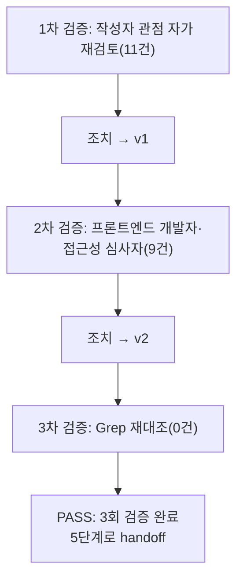

# 내부 검증 로그 (Internal Verification Log) — 04-ux-design

> 이 로그는 `docs/harness/04-ux-design.md`와, 같은 단계가 갱신한 `docs/harness/traceability.md`("UX 설계 매핑 (04 §)" 열 신설), `docs/harness/decisions.md`(DEC-013·014)를 대상으로 한다. Standard 등급(DEC-002)이라 최소 2회, 결함 0건이 나올 때까지 반복했다(총 3회).
> **방법의 한계**: 이 세션에는 셸이 없고 편집 도구도 비활성이어서 `npm test`·`node scripts/check-docs.mjs`·Playwright를 실행하지 못했다. 검증은 소스·스크린샷·문서를 직접 읽고 Grep으로 대조한 것과 색 대비의 수기 계산이다. 문서 수정은 전체 재작성(Write)으로 했다.

## 대상 산출물
- 파일: `docs/harness/04-ux-design.md`, `docs/harness/traceability.md`(UX 설계 매핑 열), `docs/harness/decisions.md`(append 2행)
- 작성 에이전트: 04-ux-designer (하네스 4단계, 소급 적용 DEC-006)
- 적용 Tier: Standard (DEC-002)
- 버전: v0 (초안) -> v1 (1차 후) -> v2 (2차 후, 최종)

## 1차 검증 (작성자 관점 자가 재검토)
- 검증자(역할): UX 설계 작성자(디자이너)
- 일시: 2026-10-01
- 수행 방법: 소스(`apps/web/src` 전체: 페이지 4, 컴포넌트 12, strings, tokens, index.css, tailwind 설정, design.test)와 스크린샷 3장(360 랜딩·대기실·회의실) 대조, 03 §4.5·§4.6·§3.6 계약 대조, 토큰 hex에서 대비 수기 계산 후 기존 `design-system.md` §2 값과 대조
- 체크리스트
  - [x] 입력 계약 반영: 02·03(PASS), traceability, decisions DEC-001~012, CLAUDE.md 디자인 규칙, 구현 UI 전체, `docs/02-design/*`, `e2e/responsive.spec.ts`를 읽었다
  - [x] 출력 계약 1~8장 존재(1 플로우, 2 화면, 3 디자인 시스템, 4 컴포넌트, 5 접근성, 6 반응형, 7 정합성, 8 변경 이력)와 5인 검토·질문 섹션
  - [x] 03과 모순 없음. 달라지는 점은 7.2 피드백으로 분리
  - [x] 계산 근거: 대비 수기 계산값이 기존 문서 값과 전부 일치(16.1/14.5/12.3/13.0, 8.2/7.4/6.3/6.7, 5.3/7.1/5.2/6.5, 9.5, 7.0, 8.5, 7.7, 8.6, 6.7)
  - [ ] 서술의 사실 정확성 → 아래 결함
- 발견된 결함 목록:
  1. **수치 오기**: 3.2 표에서 `text`/`tile`을 13.1로 적었다. 계산값 13.05, 기존 문서 13.0.
  2. **추정 오류**: 안내 바 접힌 높이를 110px로 썼으나 360px 폭(콘텐츠 약 304px)에서 요약 3줄+제목+버튼 행 합이 약 150~170px이다. 입장 버튼 여유가 약 50px뿐이라는 스크린샷 판독(y≈690/740)과 합치면 조작 예산 영향이 과소평가됨. 접힌 상태를 제목+버튼으로 줄이고(요약은 펼칠 때) 약 120px(추정, 미측정)로 재산정, 5.9 체크 기준을 130px로.
  3. **서술 오류**: 5.1 대기실 Tab 순서 문장이 `autoFocus`와 DOM 순서를 뒤섞어 모호.
  4. **오기**: 5.3 라이브 영역 표의 "아바타 타일 띠"는 "타일 재연결 띠"가 맞다(`VideoTile`의 `role=status` 띠).
  5. **누락된 실제 결함**: `ControlBar`의 안 읽은 배지가 `aria-hidden`이고 버튼 이름이 "채팅"뿐이며 수신 토스트가 없어(`MeetingController.chat:message`는 `unread`만 증가), 패널이 닫혀 있으면 스크린 리더·키보드 사용자에게 새 메시지가 전달되지 않는다 → G-15 신규.
  6. **도식 불일치**: FLOW-09 도식은 요약 문구를 접힌 상태에 쓰고 SCR-26 와이어프레임은 제목만 둔다.
  7. **누락**: 인앱 안내 [✕]를 누르면 요소가 사라져 포커스를 잃는다. 닫은 뒤 포커스 규칙이 없었다.
  8. **파일 소유 공백**: 03 unit-0는 "Landing·Lobby 각 1줄 마운트"인데 푸터는 루트 구조 변경이 필요(F-7). unit-0(W0)과 unit-15(W1) 사이 링크 폴백(F-8).
  9. **단정**: 1.9가 인앱을 "입장 불가에 가까움"이라 단정(실기기 미검증). 출처(R-3)와 미검증으로 바꿈.
  10. **존재하지 않는 요소 서술**: 5.3 랜드마크에 법률 페이지 `footer`를 적었으나 설계된 법률 페이지에는 푸터가 없다.
  11. **중복·모호**: SCR-25에서 연락처 미정을 "맨 위 상자"와 "첫 섹션 슬롯" 두 곳에 적어 중복. 첫 섹션 강조형 슬롯으로 단일화.
- 조치 내용: 위 11건 수정, `04-ux-design.md` 전체 재작성(편집 도구 불가), 8장 이력 v1 기록 (-> v1)

## 2차 검증 (독립 심사자 관점 — 역할 전환 재검토)
- 검증자(역할): 이 문서만 보고 화면을 구현할 프론트엔드 개발자 겸 접근성 심사자
- 일시: 2026-10-01
- 수행 방법: 문서 전문을 "이 문장대로 코드를 쓸 수 있는가"로 재독, 코드 사실 재대조(`Toasts.tsx`, `Lobby.tsx`, `CopyLink.tsx`, `RoomPage.tsx`), 상태 매트릭스(로딩·빈·오류·권한) 누락 점검
- 체크리스트
  - [x] 1차 지적 11건이 파일에 반영된 것을 재확인
  - [x] 신규 SCR마다 정상·로딩·빈·오류·권한 상태가 정의되었는가 → 아래 결함 6
  - [x] 03에 없는 데이터를 요구하는 화면이 없는가: 처리 기한·종료 사유·남은 시도 횟수는 표시하지 않기로 명시
  - [x] 조작 수 예산에서 신규 UI가 필수 조작을 늘리지 않는가: +0, 자동재생 차단 시 +1을 명시
  - [ ] 모호한 인터랙션·잘못된 참조 없음 → 아래 결함
- 발견된 결함 목록:
  1. **잘못된 절 참조**: 2.1 SCR-03 "연결 문제: 6장 표" — 6장에는 해당 표가 없고 내용은 1.4에 있다.
  2. **사실 오류**: 5.2가 토스트 컨테이너의 `pointer-events-none`만 근거로 "마우스는 통과"라 썼다. 토스트 본체는 `pointer-events-auto`(`Toasts.tsx` 8행)라 4.5초간 클릭을 받는다.
  3. **정의 누락**: 인앱 안내의 강제 펼침 상태에서 [✕]·접기 버튼이 있는지 없는지 정의가 없어 구현 시 임의 결정이 된다(닫으면 곧바로 다시 나타나는 모순 가능).
  4. **키 계약 누락**: 법률 슬롯 `<dl>`의 항목 이름 문구(`labels.*`), 문서 제목 키 규칙이 없고, 법률 경로 규칙(끝 슬래시, 대소문자)이 없다.
  5. **상태 필드 공백**: `background.returned`를 복귀 트리거일 때만 쓰려면 `MeetingState`에 구분 필드가 필요한데 03 §3.5에 없다 → F-9, 구현이 부담이면 생략 가능함을 명시.
  6. **요구 대비 누락**: "빈/에러/로딩 상태 필수 설계"를 신규 화면 전체에 대해 한눈에 보이는 표가 없다 → 2.3.8 신규 화면 상태 점검표.
  7. **사실 오류**: 3.1이 "입력 16px"이라 썼으나 대기실 `select`(`Lobby.tsx` 131행)와 복사 실패 입력창(`CopyLink.tsx` 37행)은 `text-sm`(14px). iOS Safari 확대 가능성 → G-16(실기기 미확인으로 표기).
  8. **누락**: 신규 컴포넌트의 E2E 선택자 제안이 없다(기존 `data-testid` 관례).
  9. **형식**: 8장 이력에 v1 행이 없어 1차·2차 반영 구분이 안 된다.
- 조치 내용: 위 9건 수정(2.3.8, 4.2 선택자, 3.5 labels 키, 2.3.2 경로 규칙, F-9, G-16 추가), `04-ux-design.md` 전체 재작성 (-> v2). `traceability.md`는 "UX 설계 매핑" 열을 70행 전부 채워 별도 작성, `decisions.md`에 DEC-013·014 append (기존 행 변경 없음)

## 3차 검증
- 검증자(역할): 독립 심사자(Grep 재대조 + 수정 부위 재독)
- 일시: 2026-10-01
- 수행(모두 도구 실행 결과 기준):
  - traceability: 요구 행 정규식 `^\| (FR|NFR|SEC|UX|POL)-\d+ \|` + 정확히 10칸 일치 **70건**(FR/NFR/SEC/UX 66 + POL-17~20 4), FR/NFR/SEC/UX 66건 = 기존 59 + 신규 7, 신규 11건 = 66-59 + POL 4 일치. 열 수 불일치 행 0건
  - 04 문서: 필수 헤딩 `## 1.`~`## 8.` 8개 + 질문·5인 검토 섹션 존재. F-1~F-9, G-1~G-16이 정의 표 행으로 **25건**(9+16), 본문·traceability에서 참조한 F/G 번호는 모두 정의됨(grep 대조). 옛 오기(`110px`, `6장 표`, `건너뜀`) 0건. 이력 행 v0·v1·v2 3건
  - 코드 사실 재확인(grep): `Lobby.tsx` select `className="input text-sm"`(131), `CopyLink.tsx` 입력창 `input text-sm`(37), `Toasts.tsx` 컨테이너 `pointer-events-none`(6)·본체 `pointer-events-auto`(8), `ControlBar.tsx` 배지 `aria-hidden`(54), `Lobby.tsx` 닉네임 `autoFocus`(152) — 문서 서술과 일치
  - decisions: DEC-013·014 존재, 기존 DEC-001~012 문장은 재작성 시 그대로 복사(append-only 위반 없음, 하네스 파일 `.claude/`, `templates/`, `ORCHESTRATOR.md`, `automation/`, 프로젝트 코드·`docs/01~06` 미수정. 수정한 파일은 `docs/harness/`의 04 문서·verify-log·traceability·decisions 4개뿐)
  - 신규 SCR-23~27, FLOW-09~13, 문구 키 목록이 문서 안에서 일관(2.0 표, 1.1 표, 3.5 표, 4.2 표)
- 발견된 결함 목록: 없음(0건)
- 한계(미검증으로 남김, 결함 아님): `npm test`·`check-docs`·Playwright 미실행(셸 없음), 대비는 수기 계산(기존 문서 값과 일치로 교차 확인), 스크린 리더·실기기(iOS Safari 입력 확대·인앱·자동재생)·비-Chromium·320px 리플로우·영상 위 글자 대비·안내 바 실제 높이는 확인하지 못함, 법률 문구는 초안이며 법령 원문 미열람, 인앱 메뉴 이름·UA 토큰은 실기기 확인 전.

## 최종 판정
- [x] PASS (결함 0건, 최소 2회 검증 완료) — 다음 단계로 handoff 가능
- [ ] PASS (Low 등급, 1차 검증 결함 0건으로 2차 생략) — 해당 없음(Standard)
- [ ] FAIL — 해당 없음

## 절차 흐름 (참고용 다이어그램)
> 아래 다이어그램은 위 절차를 시각적으로 요약한 참고 자료다. 규칙/조건의 최종 근거는 항상 위 텍스트다.

